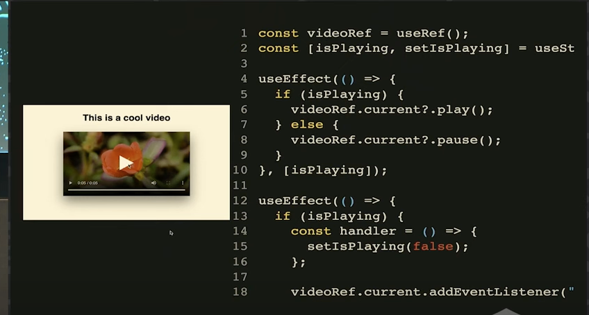

## Using useEffect Effectively

> by David Khourshid, React Advanced London 2022

### Conference Video

Why use effect how twice on mount (react 18 strict mode)?

Example of Active effect:

So, where should Action effects go?

In event handlers!

That's why if you tie an action event on rendering, react can trigger rerender for several reasons, and that
could keep causing the action to run multiple times

So, action effects should happen outside of the rendering

As example, instead of using useEffect whenever a value change, to calculate something

You can use useMemo!

Or you might not even need to use useMemo, unless you are suffering from performance problems

Easiest way to trigger infinite loop with useEffect 😂:

You don't need effect for communicating with parents

Instead we can use the event handler:

we don't use effect for subscriptions

Instead we can use the useSyncExternalStore hook

don't use effect for fetching data

instead of fetching on effect 

just fetch as you need using your framework

(remix)

(react query)

So, the general recommendation for fetching in react is: always make sure to cache your requests

so you can avoid the problems like:

- race conditions
- no instant back button (because hitting back would trigger a rerender that would trigger fetch again)
- no initial html content
- chasing waterfalls

we are used to think that if we need something to run once component renders, we need to use effect

then we end up doing something like this:

and for global inits you can just wrap in a function (opinionated alert flag\*)

we don't need effect for user interactions

we can use the event handler:

### Avoid use effect hell

when we have multiple use effects interacting with each other, like a video playback

We can use an state machine to control that instead: (you can use with useReducer)

