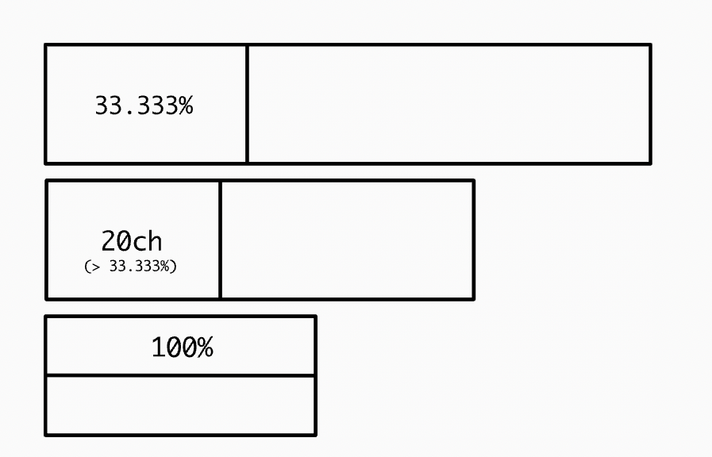

what if we wanted the sidebar to be 33.333% wide where possible? You can make `flex-basis 33.333%` then add a
`min-inline-size`:

```css
.sidebar {
  flex-basis: 33.333%;
  min-inline-size: min(20ch, 100%);
  /* ↓ when not a sidebar, let it use up all the space */
  flex-grow: 1;
}
```

The important part is using the target min-inline-size inside the min() function with 100%—a technique
borrowed from the Grid layout. Since 100% is really the maximum value for the context, we are effectively
toggling min-inline-size on and off, conditionally. Which is the kind of thing people don’t think CSS can do.



Another approach is to remove the min-inline-size declaration altogether and use clamp() for flex-basis:

```css
.sidebar {
  flex-basis: clamp(20ch, 33.333%, 100%);
}
```

The clamp() function clamps a value between upper and lower bounds. In this case, we prefer 33.333% but the
width the 33.333% proportion represents should never be allowed to get smaller than 20ch or larger than 100%.
Here’s the complete code for this specific take on the Sidebar component:

```css
.with-sidebar {
  display: flex;
  flex-wrap: wrap;
  gap: 1em;
}

.sidebar {
  flex-basis: clamp(20ch, 33.333%, 100%);
  flex-grow: 1;
}

.with-sidebar > :last-child {
  flex-basis: 0;
  flex-grow: 999;
  min-inline-size: 50%;
}
```

The component’s algorithm is now more complex and nuanced than set out in the Sidebar layout. It can be
expressed something like this: “Where the non-sidebar element is wider than the sidebar element (more than 50%
of the whole component’s width), display the two elements side-by-side, wherein the width of the sidebar
element is the smaller of 20ch and 33.333%. Where the non-sidebar element is narrower than the sidebar element
(less than 50% of the whole component’s width), stack the two elements vertically, wherein the sidebar’s width
will now be 100% whether 100% is wider or narrower than 20ch.”

That’s perhaps an unexpected amount of logic for a “declarative” language like CSS.

> Source: https://every-layout.dev/blog/sidebar-flex-basis-clamp/?ck_subscriber_id=905947838
