# Cyber Security

## Defendable Network architecture

First step to Cyber Security is to protect your assets, and to be able to do this with success, we need to
understanding how an adversary works to open breaches and compromise machines

## Assets

Protecting assets is important, but most of the time organizations doesn't have the resources, like time,
passion, or human power capability to protect everything, so it's important to stablish priorities on what to
protect

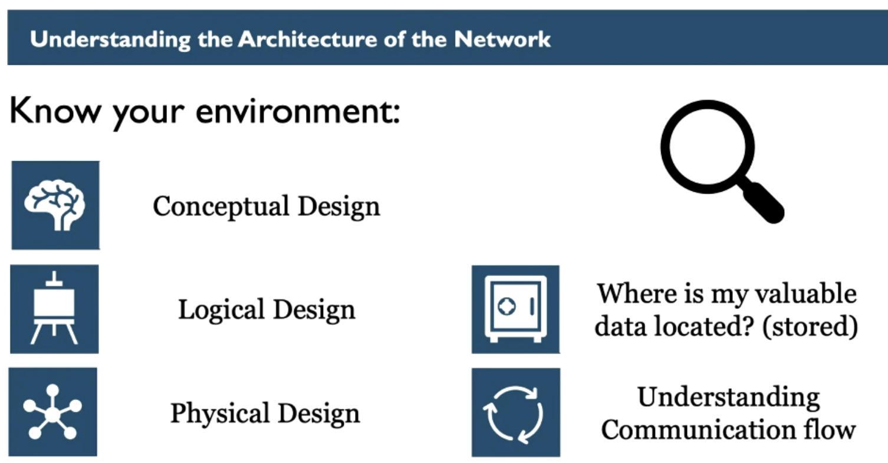

### Network Architecture

Router, Switches, Wifi, all these things are network assets that might open a breach if not protected
correctly

Does your company have an up to date network diagram?

Without an up to date network diagram it's hard to say if the network is vulnerable or not, or where the
vulnerabilities might be.

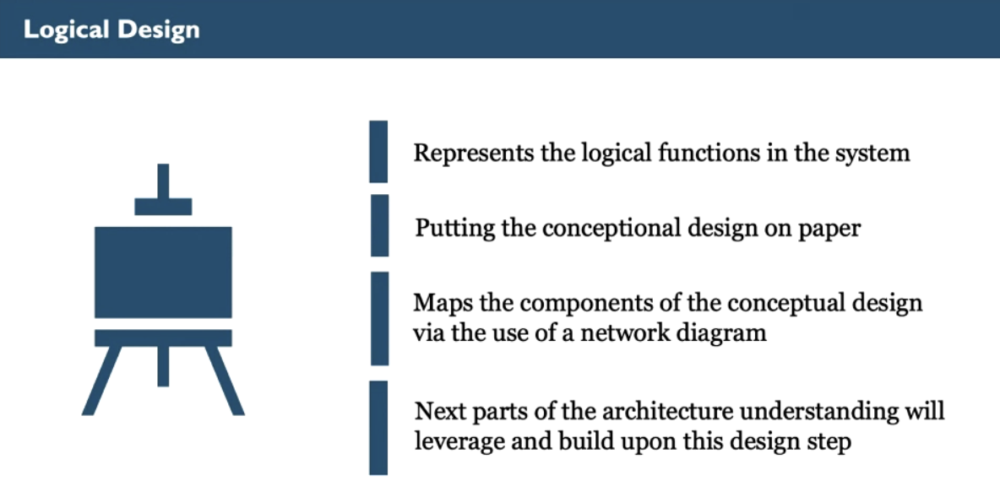

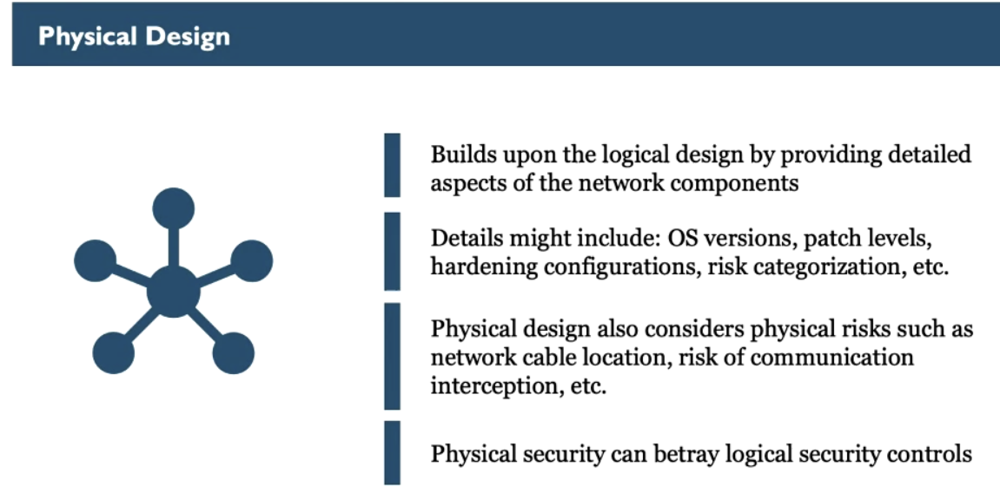

> Physical security betrays our logical controls: That means if we only strongly invest in logical security,
> like strong passwords, multi factor authentication but we don't protect the server, and anyone can walk to
> the physical server and steal the data that means the physical security betrayed the logical control

### Data

Data is the most important asset to be protected

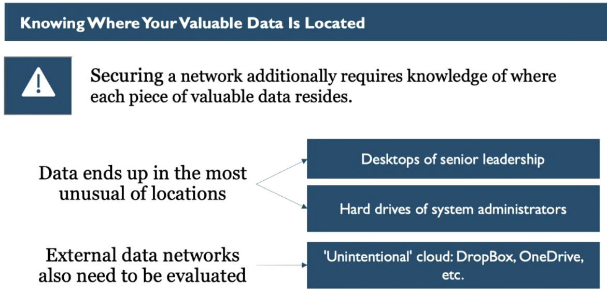

How to protect your data if you don't know where it is?

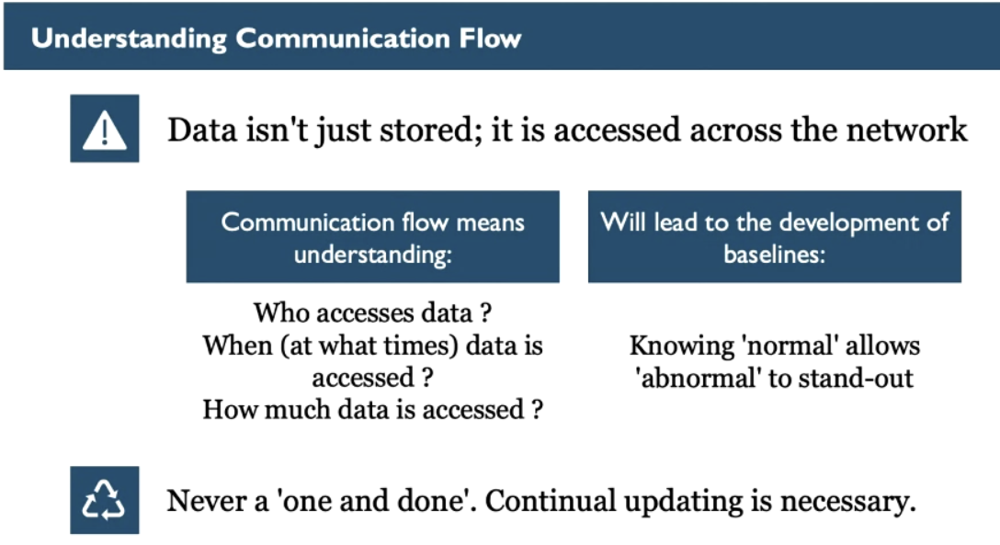

Understanding where data is located and how it's accessed makes it clearer about where and how to protect from
an attacker

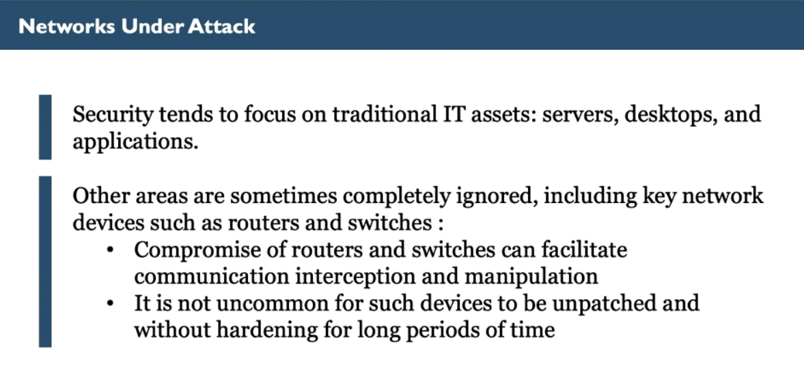

Switches form networks and router establishes communication between networks, they don't contain data, but
they might be an entry point for an attacker (weak passwords, or same password for long time, or someone can
physically connect a network cable into it)

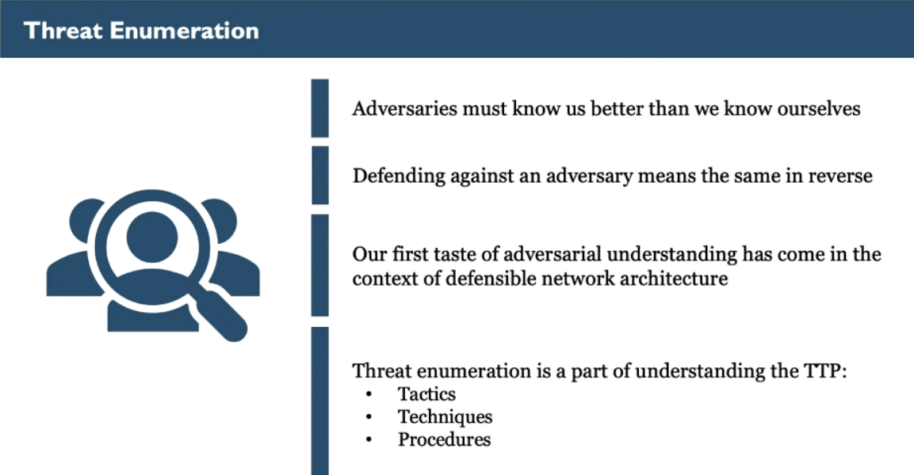

### Attacks

If some asset is not considered important, like a Router and Switch, might be interesting for the attacker,
might have outdated version without security patches, and the attacker can start attacking

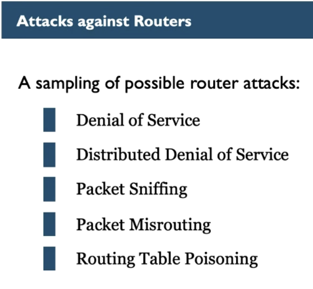

different types of attacks:

_Denial of Service:_

Denial of Service Attacks (DoS) are exactly as they sound - service of the device is being impacted (denied).
A DoS attack, at a minimum, could result in a complete and total impact on device availability. Because
routers are critical devices for any network, their availability being impacted can result in substantial
impact for any organization. Just how substantial will that impact be? The answers will vary – by organization
and by length of time of the outage but the impact is often much larger than most anticipate. As an example, a
colleague of the author who works for a very large oil and gas company and is responsible for the patching of
the organization's routers has described the patching of a router as resulting in a self-imposed DoS of 10
minutes (the router is unavailable while it is offline during the patching process). In the 10 minutes of that
patching time, the organization suffers a loss (productivity impact loss) of twenty-five million US dollars
($25,000,000 USD)! While this example of impact is not attributable to the adversary, it is an accurate
reflection of how availability can impact an organization.

_Distributed Denial of Service_:

Distributed Denial of Service (DDoS) attacks are essentially the same as DoS attacks (as described above),
albeit with one significant difference. A traditional DoS attack might have been launched from one machine, or
from one location (from a single IP address). The attack being launched from a single location might allow for
defense through the implementation of an ACL (access control list) block at an upstream network provider (like
a telecommunications provider). In order to counter the defense, the adversary will launch the attack from
many different locations, simultaneously.

This is known as a Distributed Denial of Service attack (DDoS). A DDoS attack could be launched from
thousands, hundreds of thousands, and yes – even millions of machines, simultaneously. Blocking a DDoS attack,
using ACLs, is much more difficult, if not impossible, especially if the organization is attempting to
implement the block in their own networking infrastructure. CDN (content distribution network) providers can
sometimes provide potential relief from a DDoS attack by leveraging their own massive network infrastructure
to assist in the re-routing of a victim organization's traffic or by providing enough infrastructure to handle
both the attack and legitimate traffic at the same time. Of course, the ability for the CDN to provide relief
is based upon how much money the organization is willing to spend on such a service, and the size of the
attack itself.

_Packet Sniffing_:

Packet sniffing attacks have been briefly mentioned, already. Packet sniffing refers to the capture (and
analysis) of the traffic of a network (the network's communication). Confidentiality and integrity can be
heavily impacted by the sniffing of network traffic. We will be covering sniffing in greater detail (including
working through labs during which we perform our own sniffing).

_Packet Misrouting and Routing Table Poisoning_:

Packet Misrouting and Routing Table Poisoning attacks both fit into the category of integrity-based attacks.
In either attack, victim routers are convinced to re-configure how (and where) they will route their traffic.
With packet misrouting, a router's configuration is manipulated such that traffic is no longer routed
properly; traffic might be routed to non-existent network locations, traffic might be sent back to a previous
router (resulting in a routing loop), etc.

A routing table poisoning attack results in the modification of a victim router's routing table. Routers use
their routing tables to determine the next best routing hop (which best router to next send traffic to), as
network traffic moves from router to router. Routers often update their tables by conversing with their
routing peers (allowing for routers to dynamically update and re-route traffic as necessary). In a routing
table poisoning attack, the adversary convinces a router to update its routing table, resulting in traffic
redirection. This redirection might redirect traffic to routers of an adversary's choosing (perhaps routers
controlled by the adversary), facilitating an adversary getting access to the victim's routed traffic (this is
also an example of a MiTM – Machine in the Middle – attack). A redirection of traffic is not always
immediately evident to the victim organization because network communication is not impeded. This is why MiTM
attacks can be devastating for an organization; communication is still being successfully sent and received,
but the victim is unaware the communication is transiting through an untrusted third party.

> Security costs money, but might also save money, having in mind this trade-off is important

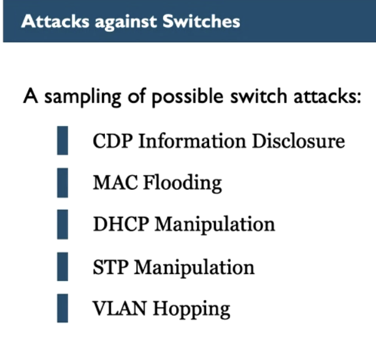

Attacks against Switches

Next, let's discuss attacks on switches. Just as was mentioned for routers, what is presented here is but a
small sampling of possible attacks on switches. In addition, while these attacks are described as attacks
'against' switches, an attack might not actually be transmitted against a switch. Some of the attacks
discussed here might be a manipulation of network traffic in a specific manner as to convince a switch to do
something it shouldn't.

As to the sampling of attacks we are now going to cover:

_CDP Information Disclosure_:

CDP (Cisco Discovery Protocol) is an example of a discovery protocol. Discovery protocols are used by many
different types of devices on networks; they are not exclusive to fundamental network devices such as
switches. From an overall network perspective, discovery protocols are used to aid devices in discovering
other devices that also exist on a network. An example is found in the Microsoft Windows environment.
Microsoft Windows-based desktops will use network discovery protocols to 'discover' other Windows-based
systems that are also connected to the same network. This allows for the easier use of the system by an
end-user; the end-user does not need to have an asset listing of what is connected to a network. The user can
simply open the File Explorer app and see what assets are available for use.

As applied to switches, switches too, need to understand which other switches exist. In order for switches to
work together, there needs to be a method to share the information of a switch's setup and configuration. One
such method of sharing some of this information will be via the use of a discovery protocol, such as CDP. CDP,
specifically, is the term used for the discovery protocol used in switches developed by Cisco Systems, but the
concept exists, regardless of manufacturer (it might just have a different name).

The information provided by a network discovery protocol might be crucial to switch operation and perhaps
equally crucial to the success of an attacker. Discovery protocols provide a tremendous amount of information.
The sniffing of such protocols can yield a substantial amount of valuable information. Such information might
include the name of the switch vendor, the version of the OS software installed, the usernames of
administrative accounts used to login to the switch, and so much more. Something as simple as the current
version of installed OS software for the switch can allow an attacker to know exactly which attack will be
successful against a specific switch from a specific vendor.

We absolutely need the information conveyed by a discovery protocol, but we don't want an attacker to have
easy access to that same information. One way to try and restrict an attacker's access is to limit the
dissemination of the discovery information (limit to where on the network the communication is broadcast).
This discovery information is important to a switch but isn't important to a desktop. By default, in most
organizations, discovery protocol traffic is more than likely being broadcast across the entirety of the
network, but it shouldn't be. By restricting the broadcast to the management interfaces of the switches, we
can limit the disclosure of this vital information in a way that makes an attacker's job more difficult. It
isn't to say that the attacker won't eventually get access to the information; however, we should make the
attacker work harder to obtain it.

_MAC Flooding_:

In a MAC (Media Access Control) Flooding attack, the attacker floods the MAC address table of a switch with
fake (non-existent) MAC addresses. We haven't discussed MAC addresses yet (that will come shortly), but we do
need enough information to describe the attack. A MAC address is a hardware address, configured at
manufacture, for networking-based devices.

Your computer may have at least two networking interfaces—wired and wireless—and both of those interfaces will
have a corresponding MAC address. MAC addresses can be used to identify a specific computing asset connected
to a network. After a computer is connected to a switch (via a network cable), the switch records the MAC
address of the computer's interface that is being connected. MAC addresses, therefore, indicate the source
and/or destination of local network communication.

Switches leverage the MAC address to determine which connected computer traffic is destined for. A switch will
only send and receive information to and from the physical switch ports where the source and destination
devices are connected. This means that an attacker, post compromise of a computing device, will only see
network traffic to and from the compromised device itself. An attacker would desire to see more, if not all,
of a network's communication. One way for an attacker to potentially obtain access to more communication
traffic, even in the presence of a switch, might be via the use of a downgrade attack against the switch. A
downgrade attack (in general) results in the convincing of a victim device to use a lower level of security
capability (lower than the security level it might be configured to use).

In a MAC flooding attack, an attacker convinces a switch that new devices continue to connect in an almost
non-stop, continual fashion (via the use of fake, non-existent, MAC addresses). Eventually (and perhaps rather
quickly), the switch will reach a point where it no longer has enough memory to record each new MAC address
that connects. The switch will start to enter an error condition, and as a part of said error conditioning,
the switch (in order to continue operating as opposed to outright shutting down), might downgrade itself to
the concept of a network hub. Hubs (the precursor devices to switches) have a fundamental security issue – a
lack of awareness as to which MAC address is connected to which physical port of the hub itself, leading to a
broadcasting of all traffic to each and every connected computer (each computer discards traffic not actually
meant for it). This allows for the sniffing of ALL network communication to be performed in an almost trivial
fashion.

_DHCP Manipulation_:

DHCP (Dynamic Host Configuration Protocol) is commonly used by computing devices to obtain their network
configuration. This network configuration will include items such as the IP address to be used by the
computing device, the subnet mask for the network segment, the IP address of the default gateway (default
router), and maybe even the IP address of a server that will provide the OS for the computing device.

Because DHCP provides valuable configuration information necessary for a device to communicate on a network,
the manipulation of that valuable configuration information could be of high value to an attacker. When an
attacker is in a sufficient position on a victim network, the attacker can monitor for DHCP requests that are
being sent from a computing device. If the attacker operates quickly enough, the attacker can supply an answer
of the DHCP request to the device before the legitimate DHCP server does. In doing so, the attacker has gained
control of the network configuration information that will be used by the computing device for its network
configuration. The attacker provides network configuration information to deceive the victim computer, perhaps
indicating that the attacker's IP address is the IP address for the default router of the network (for
example). In doing so, the victim now sends all non-local network traffic to the IP address of the 'default
router', which just so happens to be the IP address of the attacker's machine on the network (the machine the
attacker compromised). The attacker, on behalf of the victim, will forward the traffic to the actual default
router, resulting in completed communication (and a successful MiTM position). There are better ways for an
attacker to achieve a MiTM, but this attack demonstrates the risk of DHCP manipulation none-the-less.

STP Manipulation:

STP (Spanning Tree Protocol) manipulation attacks are related, in part, to the CDP attack, as described above.
As part of our CDP conversation, it was pointed out that switches need to understand how they, themselves, are
connected to one another. This is important because if switches are not connected properly, a switch loop
might occur (traffic loops in a circle). One of the responsibilities of STP is to ensure that switch loops do
not occur.

STP, like CDP, is plaintext (readable and observable). An attacker, with sufficient access to a network, might
be able to impersonate STP communication and manipulate it to their advantage. If successful, the result will
be switch re-configuration. Such manipulation could be performed in an effort to cause a switch loop
(resulting in a DoS), or to intentionally re-configure the switches to facilitate a MiTM capability. STP can
itself be configured to help prevent unintentional manipulation, and just like CDP, STP should be available
only to management interfaces (not the network overall).

_VLAN Hopping_:

VLAN (Virtual Local Area Network) is a concept of network segmentation. We will be covering VLANs shortly but
is mentioned here in the terms of a switch-based attack known as "VLAN hopping". Switches connect devices
together, to form a network, in the spirit of all devices being equally accessible for device-to-device
communication. This, however, assumes that our devices are of all the same trust level (which they are not). A
model of intrinsic trust will allow an adversary to more easily pivot across the devices of a network.

Network segmentation is a method of enforcing the concept that devices should not be allowed to communicate
with one another simply by the nature of being connected. Network segmentation, such in the form of a VLAN,
makes the life of an adversary initially more difficult and is why an adversary may attempt a VLAN hopping
attack. In the formation of a VLAN hopping attack, an attacker will manipulate the characteristics of network
packets in such a way that a switch will allow an attacker to 'hop' from one VLAN to another in a way that
would otherwise be prohibited.

## Physical and Logical Topologies

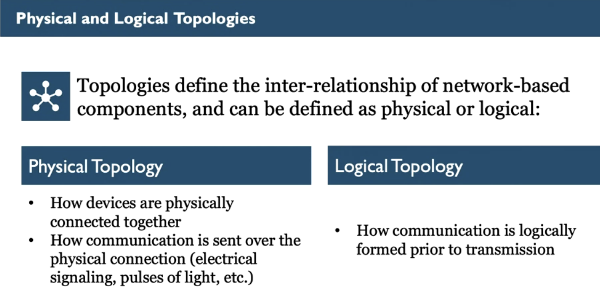

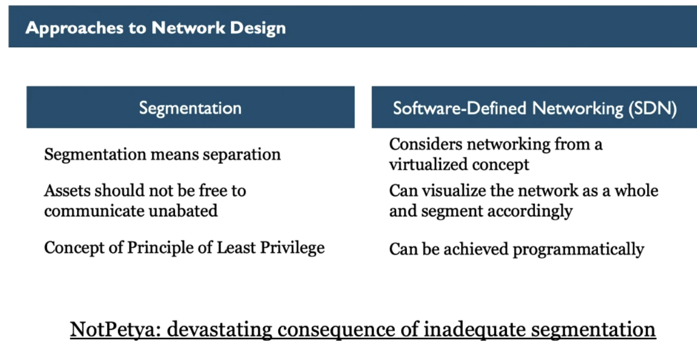

Segmentation is the separation of concerns, something being connected to the internet doesn't mean it should
be accessible by anyone (authentication), being authenticated doesn't mean you can access everything
(authorization)

#### Virtual Lan

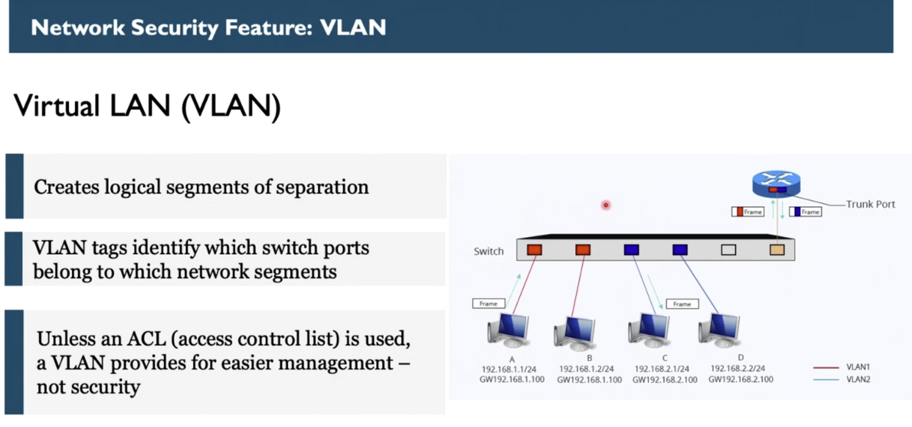

#### 802.IX

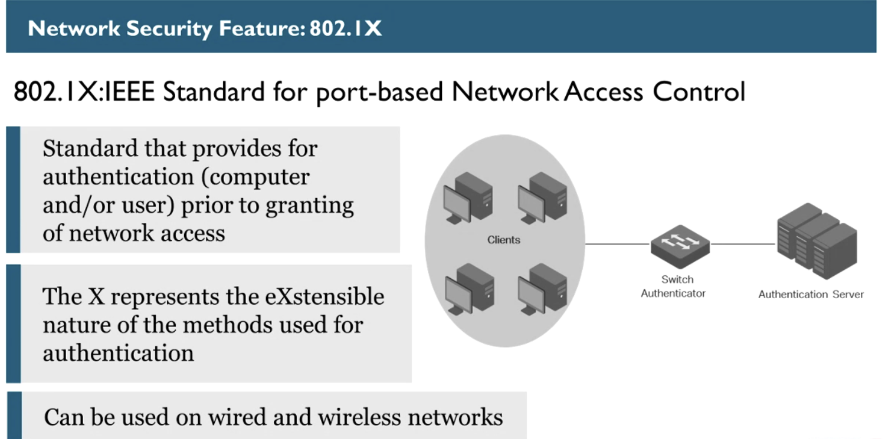

This is a standard authentication, so users can't access network by just plugging a cable

Setting up password on routers/switches shouldn't be the only mean of defending, always ask yourself what
happens if someone unauthenticated access it, what access it would have?

### Network Design examples

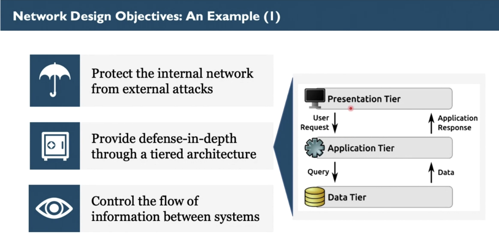

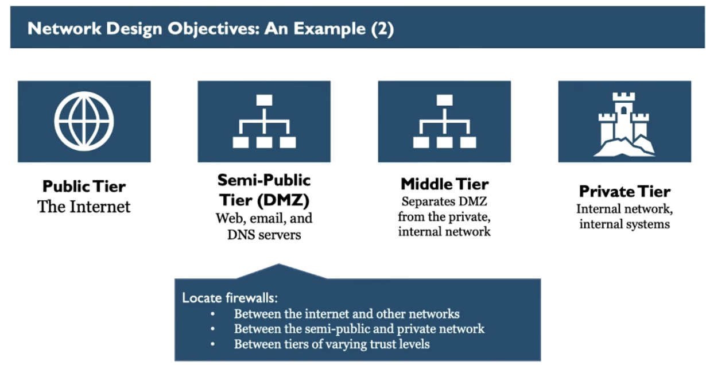

_Public:_

Resources that reside on the internet cannot be trusted and, therefore, represent a tier of high-risk and
low-trust.

_Semi-public (DMZ):_

The DMZ (Demilitarized Zone) represents a tier of the network used for organizational systems that intend to
be public-facing. Such systems include the web servers for our website, the email servers used to send and
receive email, and the DNS (Domain Name Service) servers necessary to translate the names of these DMZ
resources into corresponding IP addresses. DMZ systems are at great risk of compromise by the nature of being
connected to a public tier over a continuous period of 24 hours per day, and 7 days per week. An assumption
might be made that DMZ devices will be compromised at some point in time, as a result of this continuous
connection to the public tier. In order to combat the risk a security effort to best secure the DMZ will be
made. However, due to the overall risk present none-the-less, the tier is considered to be high-risk with a
slightly increased level of trust (as compared to systems in the Public tier).

_Middle Tier:_

The middle tier represents the most important segmentation in this model: the separation between the DMZ and
the private (internal) network tier.

The middle tier can be represented in different ways depending on which technology is used for the
implementation. In the example of the previous slide, the middle tier was referred to as an 'application
tier'. A reverse proxy is an example of such a concept. Proxies separate the two ends of a communication; the
web server cannot communicate directly with the back-end database on the internal network segment and
vice-versa. If the web server desires to send a communication to the back-end database, the request must
instead be sent first to the proxy for analysis. The proxy will analyze the request to verify that the request
is expected, that it matches the characteristics of an expected request, and that it does not appear to be
malicious. If the proxy determines that the communication should be allowed, the proxy will pass the request
on to the back-end database. The same will happen in reverse; the back-end database will return a
communication to the web server via the proxy. When received by the proxy, the proxy will perform the
inspection (as described above) and if the communication is deemed acceptable, the proxy will then forward
that communication to the web server.

_Private:_

Private, as applied here, is referring to the internal network segment. The internal network segment is where
we will find our trusted organizational assets (production). These systems represent critical functionality
and as such there is no direct connection between them and the internet. This segment represents the final
tier of our segmentation example. It is a tier of higher trust and lower risk.

One item that has been left out of the above descriptions (so that it may be discussed here) is the idea that
there is yet another aspect of separation in play: firewalls. Firewalls are preventative security devices that
will further restrict communication (to only what is necessary to be transmitted) between the various tiers.
Firewalls, and how they work, will be discussed in a later module.

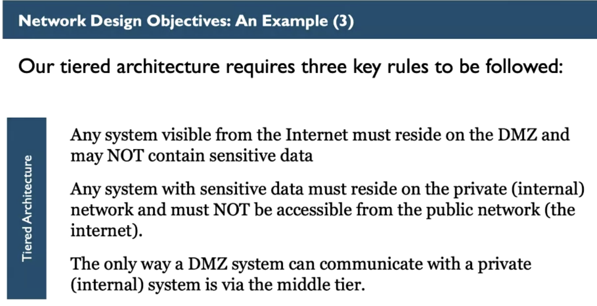

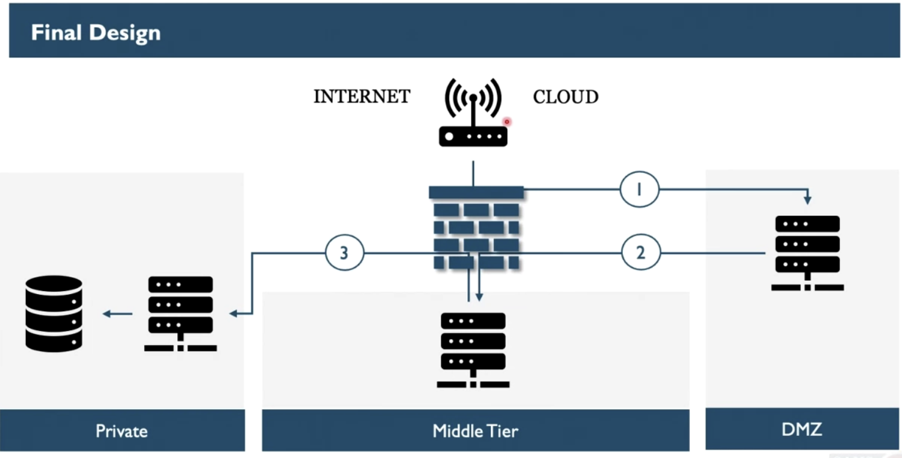

Benefits of Network Architecture Understanding

As this module draws to its conclusion, let's review the benefits we can take advantage of by having a clearly
articulated understanding of network architecture.

First, the knowledge of what we have connected to our network, how that connected capability is configured
(hardened), what its patch levels are, etc. gives us the concept of situational awareness. It's true that we
can't secure what we are unaware of, but even more importantly, knowing of assets that are no longer required
(and subsequently removed) will result in in the enforcement of having only the assets necessary to the
achievement of our organizational goals (and nothing more). This in another example of the least privilege
principle.

Second, by knowing what assets we have, along with the related criticality of the same, will allow for an
appropriate prioritization of effort. No organization has unlimited time, energy, nor the budget necessary to
secure every asset to its most hardened configuration possible. Perhaps, (potentially controversial), an asset
should probably not be secured, only for the sake of securing it. We should secure our assets, relative to the
risk of those assets, in consideration of criticality and for the length of time necessary, and not a moment
more.

Third, by becoming aware of assets that are no longer required in operation, we can remove assets that no
longer provide contributed value. An asset that no longer exists is also an asset that no longer requires our
attention or effort to secure. As such, the cost of our efforts will be reduced.

And finally, possessing the knowledge of how our environment is constructed, understanding how assets
communicate, being able to articulate communication flow (and so forth) will result in (perhaps) the most
beneficial consequence: timely detection of an attacker. By understanding what 'normal' looks like for an
environment, 'abnormal' will surely stand out. The moment we notice abnormal is the moment we can move into an
incident response. The moment we begin to respond … that is the moment we start to reduce the total amount of
damage that could be caused by the incident, providing further cost savings for the organization.

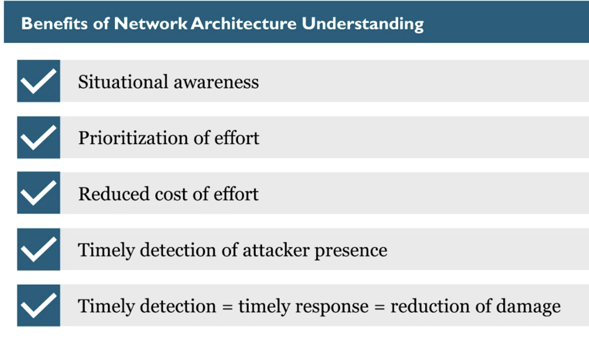

> Balance your security effort: Making hard for the final user without no real benefit, just for sake of
> security is not an effective security, because can reduce product value

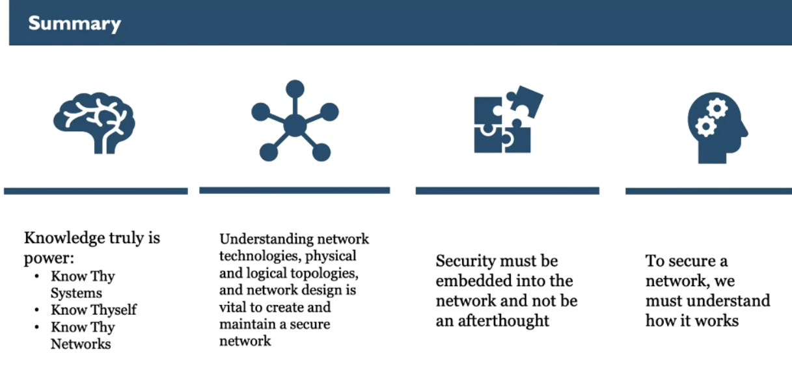
