## VMs

Virtualization is a foundation for Cloud

## Cloud

Cloud is a concept of abstractions, in your own hardware (private cloud) or someone else's hardware (public
cloud).

Organizations can run on Hybrid scenario (private and public)

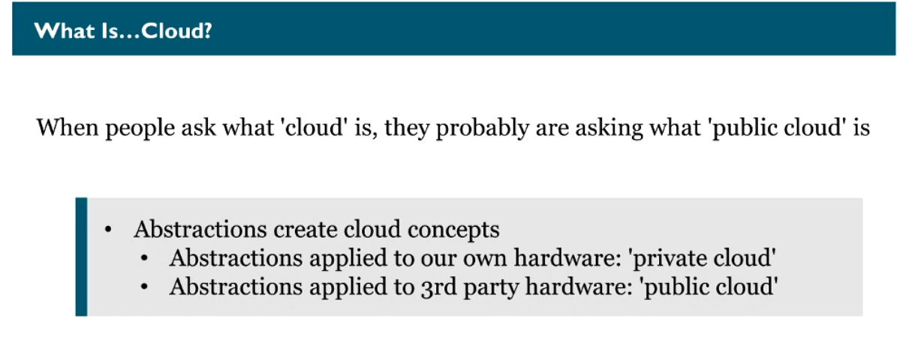

### Cloud Providers

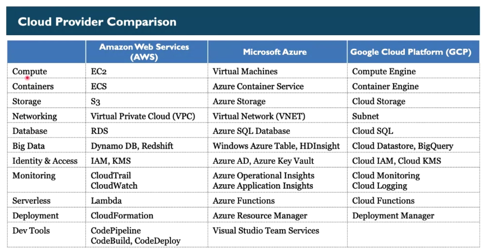

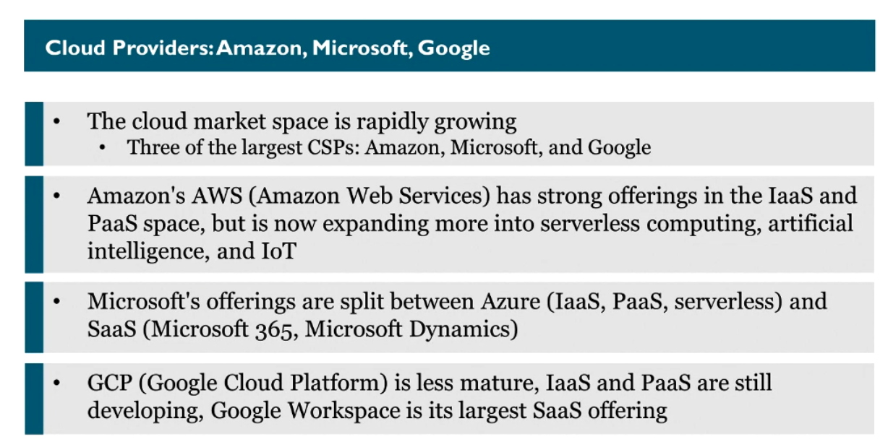

### advantages of cloud

- don't need to buy the hardware, you can rent it
- don't need to maintain the IT infrastructure to run that hardware
- we can rent only what we need for the time we need

### types of cloud services

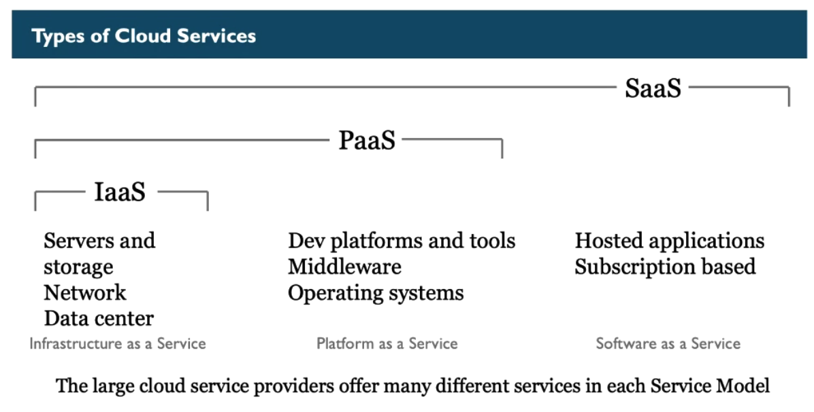

- IaaS (infrastructure as a service)

for example: amazon aws, google cloud

- PaaS (platform as a service)

for example: Vercel

- SaaS (software as a service)

for example: microsoft office 365

### Serverless

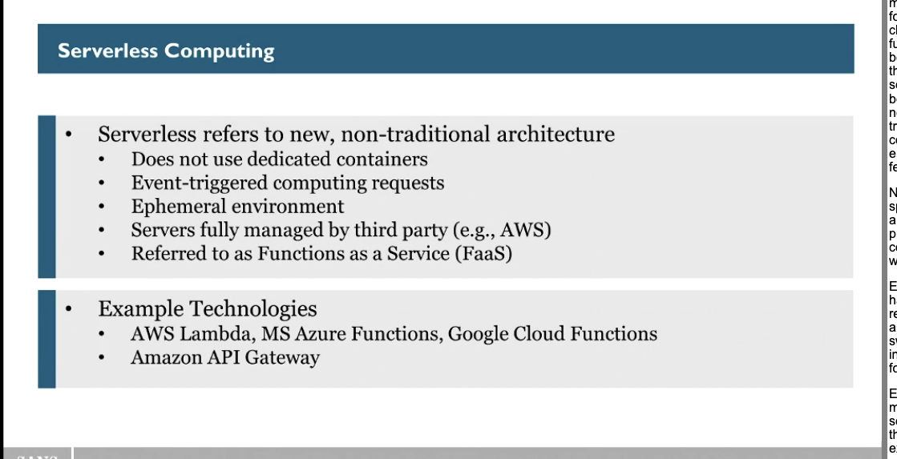

- FaaS - functions as a service

with serverless we don't need to care about managing the hardware or operating system, we can rent a part of
that hardware and OS to execute a single function for a determined amount of time or executions

### IaC - Infrastructure as a Code

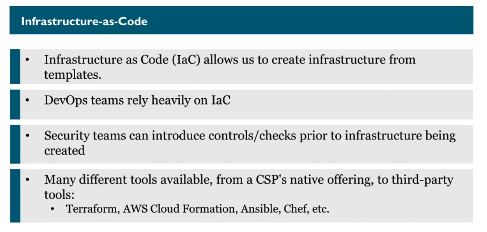

Codes for creating infrastructures, for example: Terraform

### Shared Responsibility on Cloud

an organization can't never abdicate from security just because it's data is on the cloud

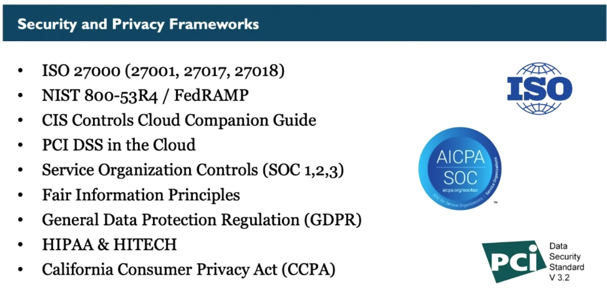

a cloud provider might be compliant by several compliances, but that doesn't mean it's customer are
automatically compliant

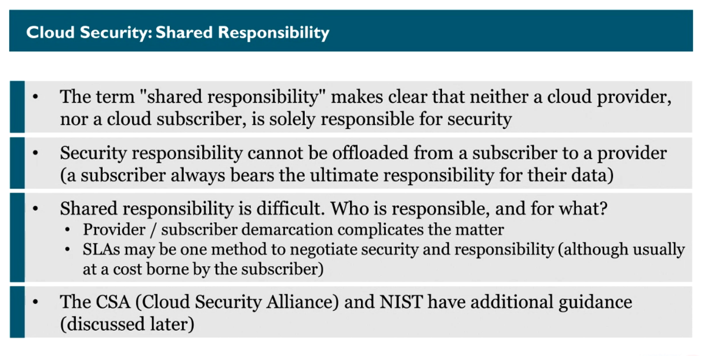

AWS: security of the cloud (provider) vs security in the cloud (customer)

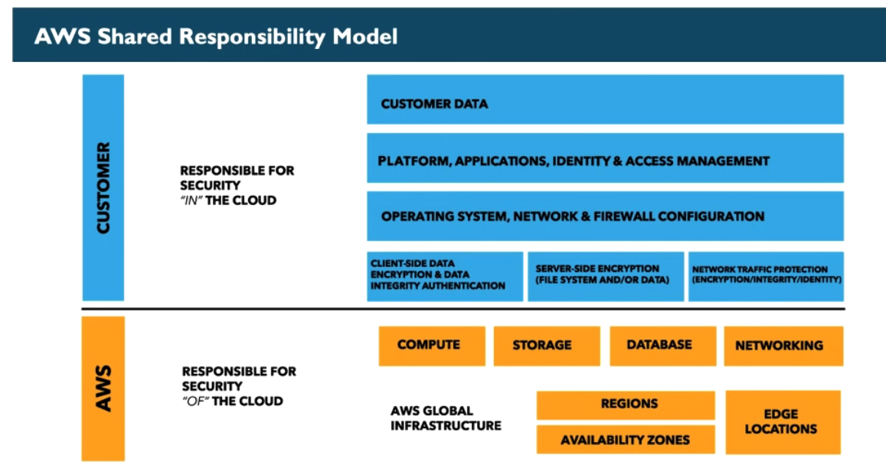

Microsoft:

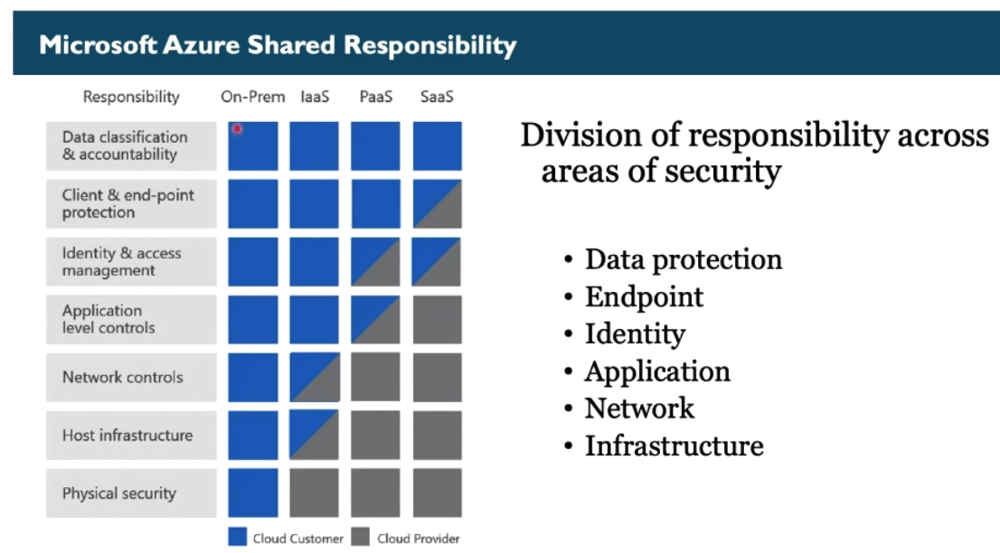

## CSA - Cloud Security Alliance

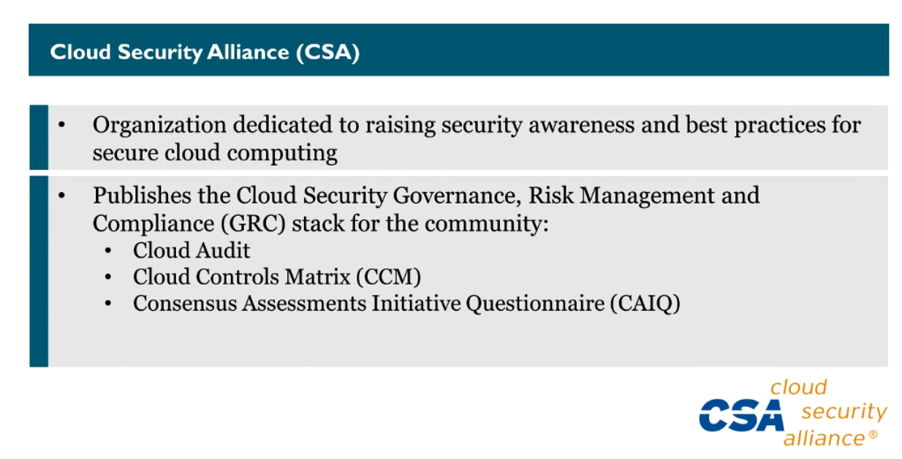

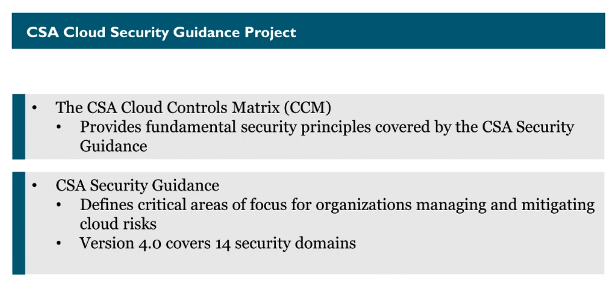

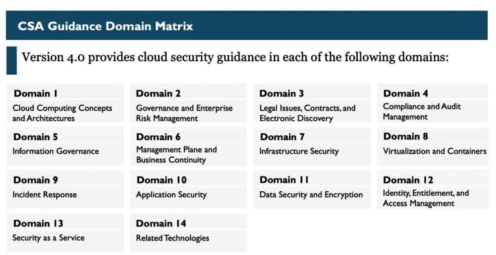
