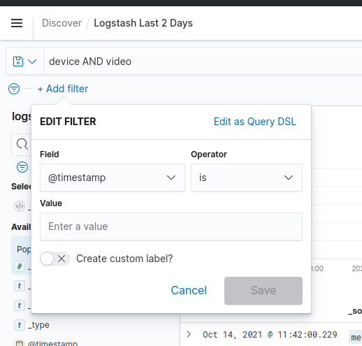
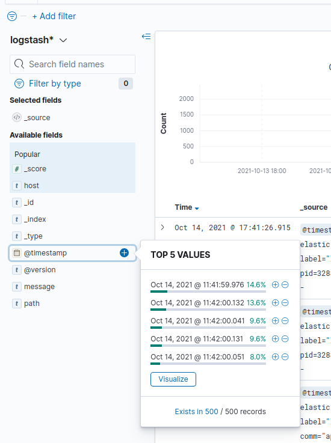
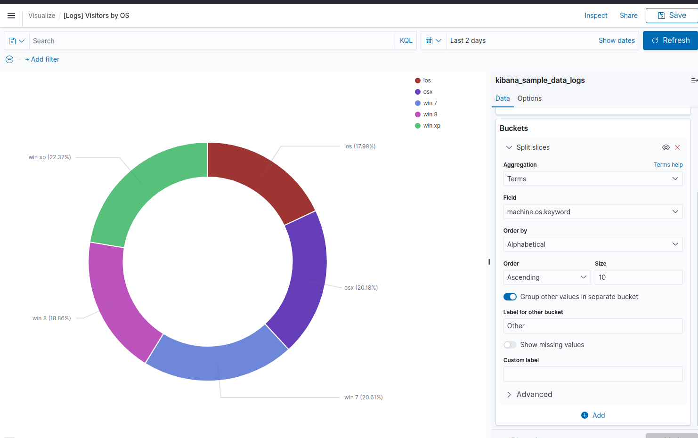
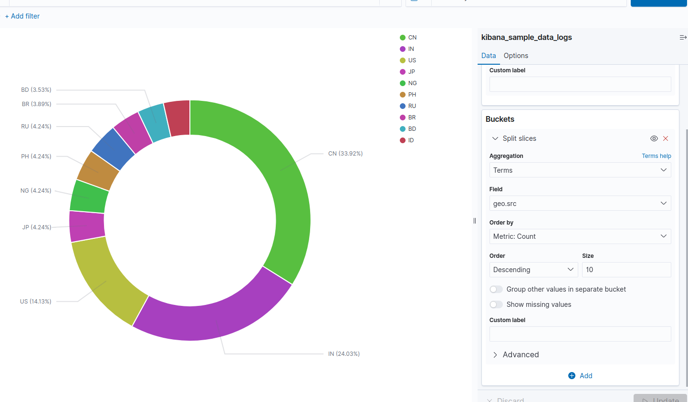
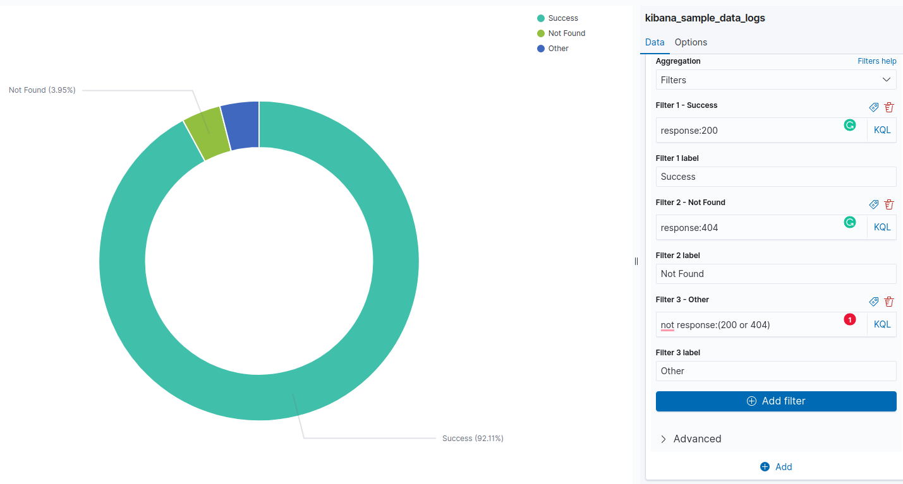
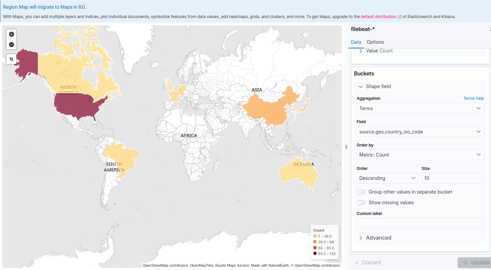

# Kibana

## Discover

### KQL

Kibana Query Language or KQL, it's a query language that is used to query the
data in Kibana.

Examples:

- `device AND video`

- `device OR video`

- `"video device"` (Exact query with ")

- `bytes>5000` greater than

Also supports parenthesis.

`bytes>5000 and host:www.elastic.co or host:artifacts.elastic.co` vs
`bytes>5000 and (host:www.elastic.co or host:artifacts.elastic.co)`

short version for parenthesis:
`bytes>5000 AND host:(www.elastic.co or artifacts.elastic.co)`

- wildcards: `bytes>5000 AND host:(www.elastic.co or artifacts.*)`
- wildcards for fields: `bytes>5000 AND geo*:*`

### Filters

You can also add filters, and it can be manually



or by selecting the top 5 values on the left sidebar, the "+" button will add
the filter and the "-" button will add a `NOT` keyword filter.



Selecting fields we can visualize the co-relation between the fields.


> Also there is the KQL equivalent: `host:artifacts.elastic.co`

## Visualization

### Aggregation: Terms





### Aggregation: Filters



## Dashboards



## Developing in Kibana

- [Guide](https://www.elastic.co/guide/en/kibana/master/development-getting-started.html)

### Run Elasticsearch

Run the latest Elasticsearch snapshot. Specify an optional license with the
--license flag.

`yarn es snapshot --license trial`

### Run Kibana

In another terminal window, start up Kibana. Include developer examples by
adding an optional --run-examples flag.

`yarn start --run-examples`

`yarn start --help`

```text
Usage: bin/kibana [command=serve] [options]

Kibana is an open and free, browser based analytics and search dashboard for
Elasticsearch.

Commands: serve [options] Run the kibana server help <command> Get the help for
a specific command

"serve" Options:

    -e, --elasticsearch <uri1,uri2>  Elasticsearch instances
    -c, --config <path>              Path to the config file, use multiple --config args to include multiple config files (default: ["/home/paulo/elastic/kibana/config/kibana.yml"])
    -p, --port <port>                The port to bind to
    -Q, --silent                     Set the root logger level to off
    --verbose                        Set the root logger level to all
    -H, --host <host>                The host to bind to
    -l, --log-file <path>            Deprecated, set logging file destination in your configuration
    --plugin-path <path>             A path to a plugin which should be included by the server, this can be specified multiple times to specify multiple paths (default: [])
    --optimize                       Deprecated, running the optimizer is no longer required
    --oss                            Start Kibana without X-Pack
    --run-examples                   Adds plugin paths for all the Kibana example plugins and runs with no base path
    --dev                            Run the server with development mode defaults
    --ssl                            Run the dev server using HTTPS
    --dist                           Use production assets from kbn/optimizer
    --no-base-path                   Don't put a proxy in front of the dev server, which adds a random basePath
    --no-watch                       Prevents automatic restarts of the server in --dev mode
    --no-optimizer                   Disable the kbn/optimizer completely
    --no-cache                       Disable the kbn/optimizer cache
    --no-dev-config                  Prevents loading the kibana.dev.yml file in --dev mode
    --no-dev-credentials             Prevents setting default values for `elasticsearch.username` and `elasticsearch.password` in --dev mode
    -h, --help                       output usage information
```
