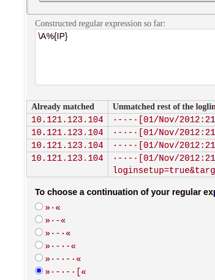

# About logstash

- input: is where you define the source of the data
- filter: is where you define the rules to transform the data
- output: is where you define the destination of the transformed data

```
input { stdin {} }

filter {
  mutate {
    add_field => { "greeting" => "Hello %{message}" }
  }
}

output { stdout {}}
```

with this config you enable a interactive log that output hello [message typed
in cli]

## Listing logstash plugins:

- list all plugins with `/usr/share/logstash/bin/logstash-plugins list`

## Input plugins: beats

```
input {
  beats {
    port => 5044
  }
}
```

## Input plugins: file

```
input {
  file {
    path => "/var/log/file-you-want-to-import.log"
  }
}
```

- you can use wildcards, like `/var/log/file-*.log` or get the entire directory

## Output plugins: elasticsearch

```
output {
  elasticsearch {
    hosts => ["localhost:9200"]
  }
}
```

- You can set one server or multiple servers

## Output all sort of places

- logstash-output-graphite: get transformed data and send it to grafana
- logstash-output-sqs: generate eventsto an AWS SQS queue
- logstash-output-pipe: pipe to `stdin` of an arbitrary process

## Grok

One of the main plugins

- plugin for parsing unstructured data into structured data
- regular expressions to match patterns in the input

```
filter {
  grok {
    match => { "message" => "%{IP:x} %{WORD:m} %{URIPATHPARAM:r} % %{NUMBER:b} %{NUMBER:d}" }
  }
}
```


### Resources

- [Grok Constructor](https://grokconstructor.appspot.com/do/construction?example=2)

```
10.121.123.104 - - [01/Nov/2012:21:01:04 +0100] "GET /cluster HTTP/1.1" 200 1272
10.121.123.104 - - [01/Nov/2012:21:01:17 +0100] "GET /cpc/auth.do?loginsetup=true&targetPage=%2Fcpc%2F HTTP/1.1" 302 466
10.121.123.104 - - [01/Nov/2012:21:01:18 +0100] "GET /cpc?loginsetup=true&targetPage=%252Fcpc%252F HTTP/1.1" 302 -
10.121.123.104 - - [01/Nov/2012:21:01:18 +0100] "GET /cpc/auth.do?loginsetup=true&targetPage=%25252Fcpc%25252F&loginsetup=true HTTP/1.1" 302 494
```

IP, datetime, uripath, http status




\A%{IP} - - \[%{HTTPDATE}] %{QS}

if some data does not match you will get grokparsing error

## Mutate

plugin for transforming the data


