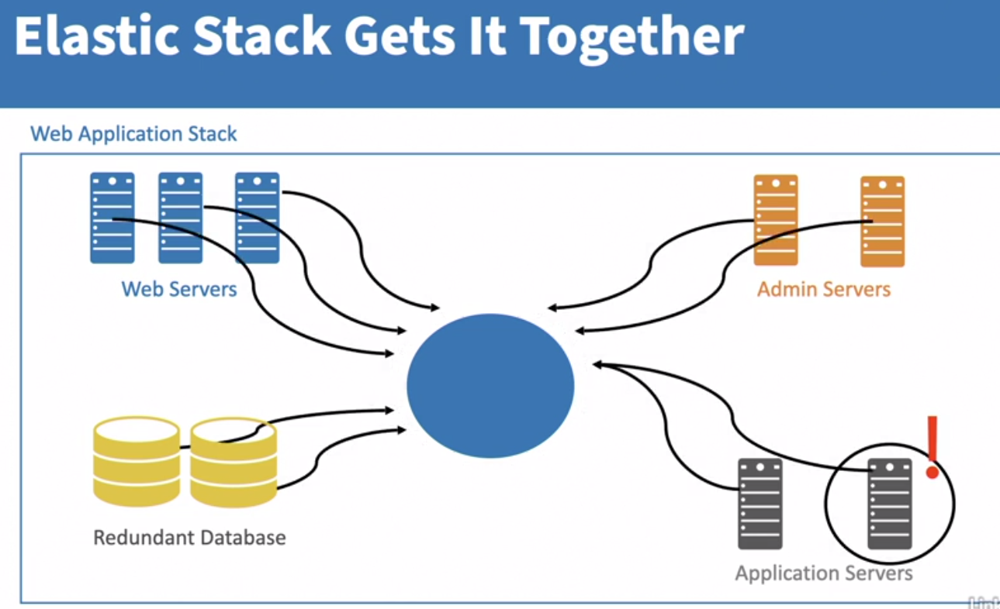
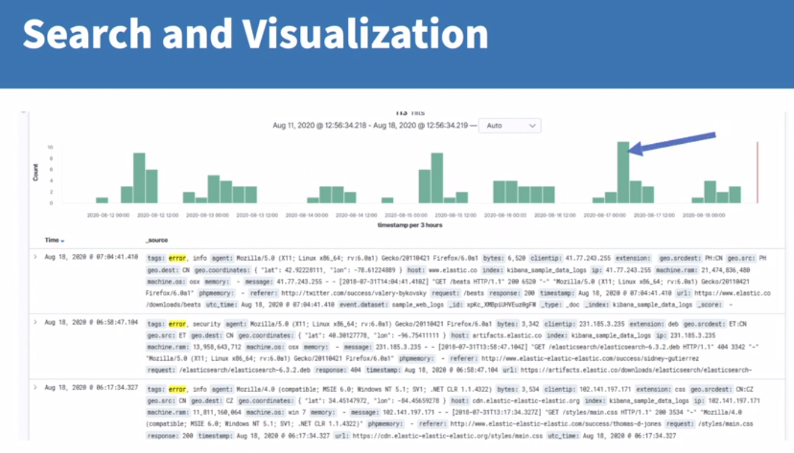
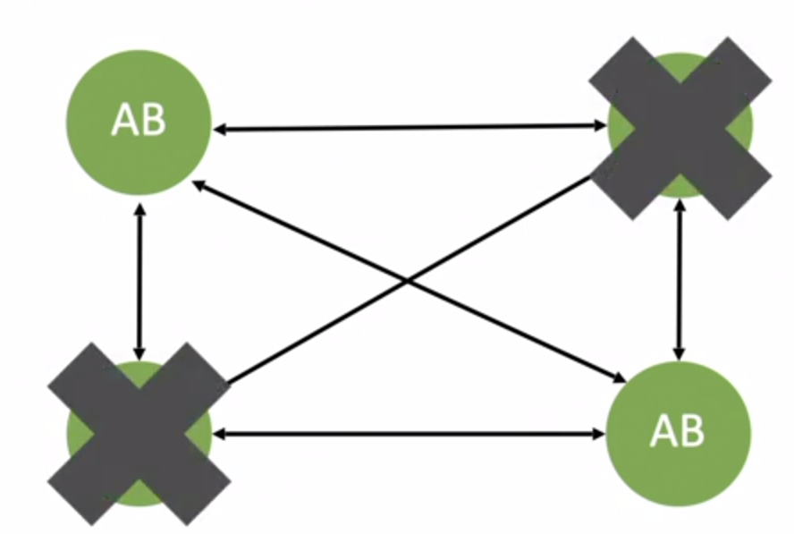
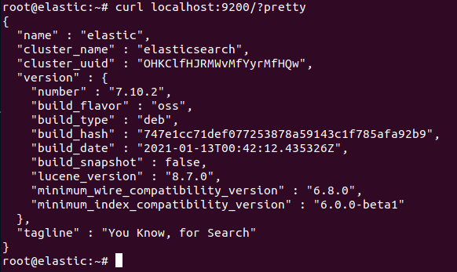
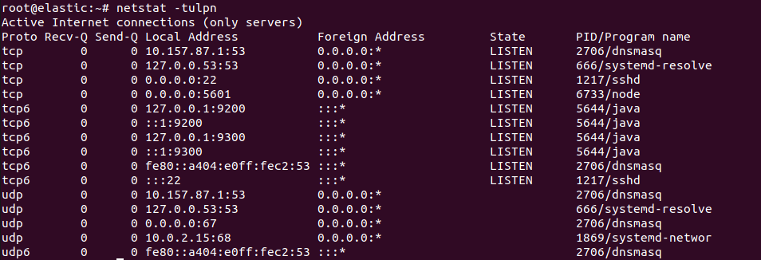
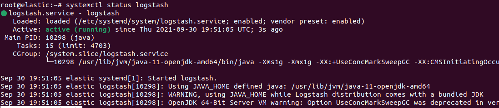
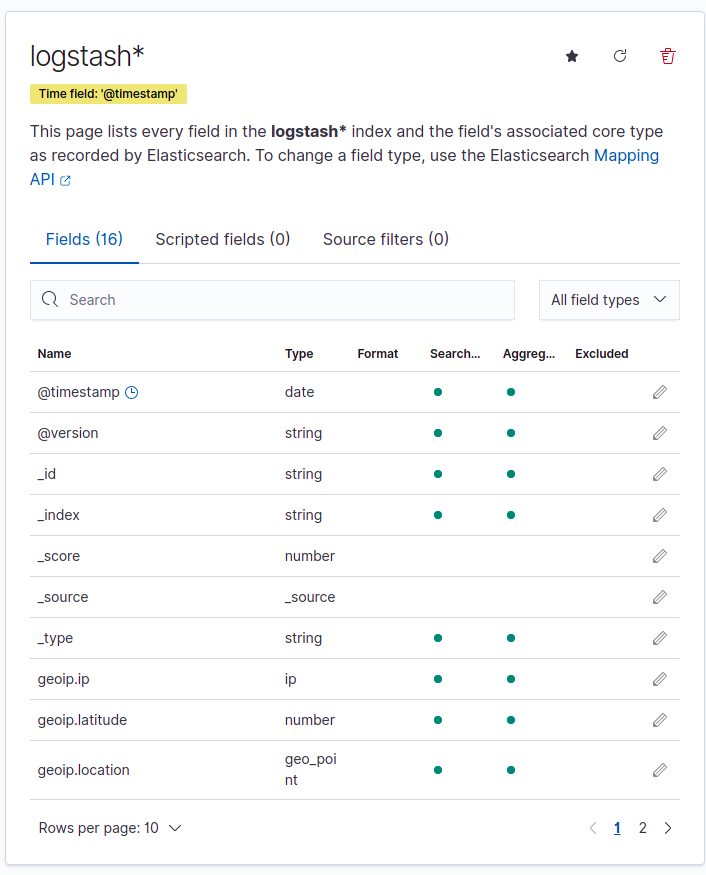
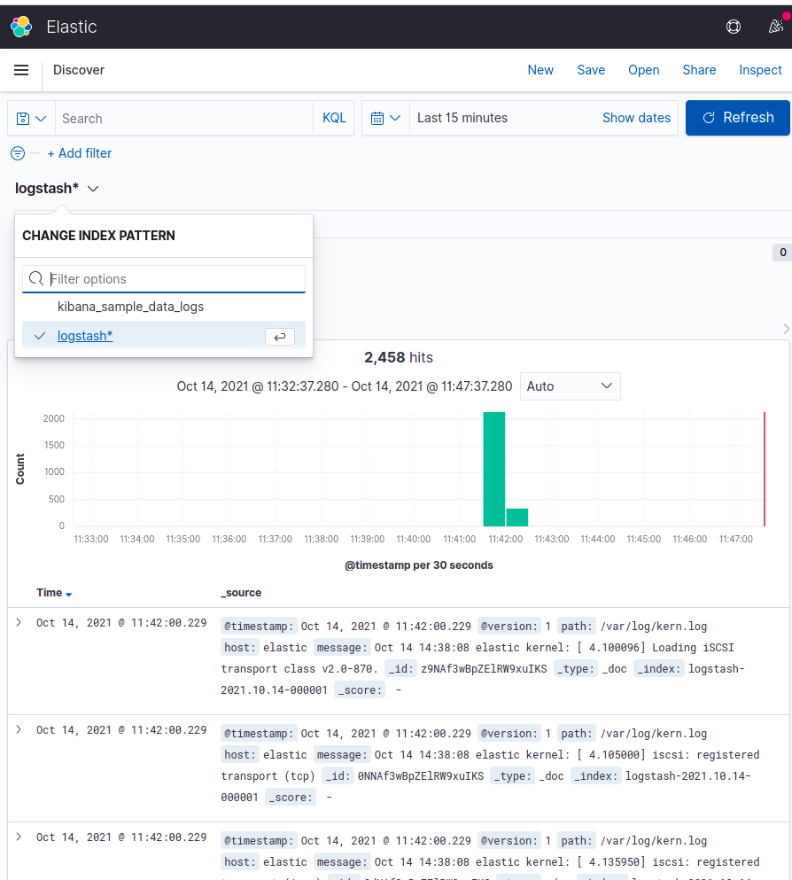

# Elastic Stack

## The ELK Stack

The Elastic Stack was previously called ELK stack, because it (mainly) included:

- [Elasticsearch](https://www.elastic.co/products/elasticsearch)
- [Logstash](https://www.elastic.co/products/logstash)
- [Kibana](https://www.elastic.co/products/kibana)


But it now includes other services like Beats and others

## Common Uses / Principles

### Powering search

We can use Elasticsearch to power up searches provided by backend services.

### Centralized Logging

If one of our services have any kind of problem, with centralized logs we can
for example go to one central place to check what's going on and where to look
for the problem, instead of looking at each one of our services.



By using Kibana we can also create dashboards to visualize our logs, for
example, we can click to filter on a determined spike of error logs instead of
looking at all of them.



## Intruducing the Stack

### Beats

Beats is a light-weight way of getting data into the ELK Stack, there are
individual sets of packages written in Go that can be used to collect data from
various sources and send it to Elasticsearch, like:

- Filebeat - tool for shipping system logs into the stack
- Packetbeat - tool for shipping network logs into the stack
- Metricbeat - tool for shipping metrics into the stack
- etc.

You can write your own beat to collect data from other sources and also use the
ones that are maintained by the community. Beats are lightweight, single-purpose
tools.

### Logstash

Before Beats, there was just Logstash, which was a tool that allowed you to
ingest data, its main purpose is for transforming data as as it's coming in, and
then ship it out to Elastic Stack.

For example, unstructured data like plain text file, can be transformed into
structured data objects/documents, like JSON.

Also, Beats and Logstash can work together

### Elasticsearch

- Holds all of the data itself
- Also holds the index of that data for searching
- Can store more than one index of data

In production, it's stores in clusters, it does this by splititng up the data
and indexes, so it has redundant data across the clusters.


But of course, if all the redundant copies are removed, we have to manually
recover the data.



### Kibana

Allows you to visualize the data, it's the front-end of the stack, it provides:

- Ad hoc search
- Visualization of the data
- Dashboards
- etc.

### Installing Elastic Stack with Vagrant basics

#### Setting sandbox

- Install Vagrant
- Install VirtualBox

#### Installing Elastic Search

1. Log into the VM and become root:

```bash
vagrant ssh
sudo su -
```

2. Set GPG key:

```bash
wget -qO - https://artifacts.elastic.co/GPG-KEY-elasticsearch | apt-key add -
```

3.  Add elastic repository:

```bash
echo "deb https://artifacts.elastic.co/packages/oss-7.x/apt stable main" | sudo tee -a /etc/apt/sources.list.d/elastic-7.x.list
```

4. Update package manager and install Elastic Search:

```bash
apt-get update && apt-get install elasticsearch-oss
```

5. Enable Elastic Search to start on boot:

```bash
systemctl enable elasticsearch
```

6. Start Elastic Search:

```bash
systemctl start elasticsearch.service
```

7. Test if Elastic Search is running:

```bash
curl localhost:9200/?pretty
```



#### Deploying Kibana

1. Install Kibana:

```bash
apt-get update && apt-get install kibana-oss
```

2. Enable Kibana to start on boot:

```bash
systemctl enable kibana
```

3. Start Kibana:

```bash
systemctl start kibana.service
```

4. Test if Kibana is running:

```bash
journalctl -u kibana
```

5. Edit kibana.yml and change the `host` from `localhost` to `0.0.0.0`:

```bash
vim /etc/kibana/kibana.yml
# ...
# Change and uncomment the following line:
#server.host: "localhost"
# to
server.host: "0.0.0.0"
```

6. Restart Kibana

```bash
systemctl restart kibana
```

Obs: If using Kibana in production, you might want to change this configurations
from kibana.yml:

- server.name
- elasticsearch.hosts (if using multiple Elasticsearch hosts)

7. Check if Kibana is running with the correct host:

```bash
netstat -tulpn
```

You should be able to see it running in the host `0.0.0.0` and port `5601`



8. Open Kibana in a browser:

http://localhost:5601

> You can play around by loading sample data

#### Configuring Logstash

1. Install Java

```bash
apt-get update && apt-get install openjdk-11-jre
```

2. Install Logstash:

```bash
apt-get update && apt-get install logstash-oss
```

3. Set the Java HOME variable:

```bash
vim /etc/default/logstash
# add the following line:
JAVA_HOME="/usr/lib/jvm/java-11-openjdk-amd64"
```

4. Enable Logstash to start on boot:

```bash
systemctl enable logstash
```

5. Check if Logstash is running:

```bash
systemctl status logstash
```



6. Try Logstash:

> Note: don't use syslog, because the elastic stack uses it, and if you use it,
> everything that is logged will generate more logs, and you will end up with an
> infinite loop

Add the following file to `logstash` conf:

```bash
vim /etc/logstash/conf.d/kern.conf
```

```
input {
  file {
    path => "/var/log/kern.log"
    start_position => "beginning"
    #Uncomment the following line to force logstash to reingest file
    #sincedb_path => "/dev/null"
  }
}

filter {
  if [type] == "syslog" {
    grok {
      match => { "message" => "%{SYSLOGTIMESTAMP:syslog_timestamp} %{SYSLOGHOST:syslog_hostname} %{DATA:syslog_program}(?:\[%{POSINT:syslog_pid}\])?: %{GREEDYDATA:syslog_message}" }
    }
  }
}

output {
  elasticsearch { hosts => ["localhost:9200"] }
  stdout { codec => rubydebug }
}
```

Add read access to the `kern.log` file, so Logstash can read it:

```bash
chmod a+r /var/log/kern.log
```

Restart logstash

```bash
systemctl restart logstash
```

#### Troubleshooting

If you don't see logstash logs, probably there are errors in the configuration,
try checking:

- if the versions of logstash and elasticsearch are the same
- if logstash has permissions to read the file(s)
- try checking logstash status with `systemctl status logstash`

## Managing index patterns

Before showing logs in kibana it need to be indexed

Go to `http://localhost:5601/app/management/kibana/indexPatterns` to manage
index patterns.



Now we can see the `logstash` index we just added



```

```
