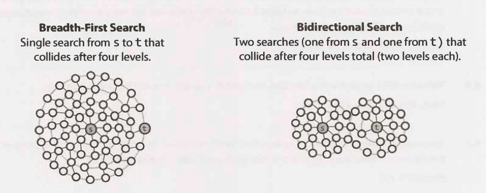

Bidirectional search is used to find the shortest path between a source and
destination node. It operates by essentially running two simultaneous
breadth-first searches, one from each node. When their searches collide, we have
found a path.

To see why this is faster, consider a graph where every node has at most `k`
adjacent nodes and the shortest path from node `s` to node `t` has length `d`.

- In traditional `breadth-first` search, we would search up to `k` nodes in the
  first "level" of the search. In the second level, we would search up to `k`
  nodes for each of those first `k` nodes, so `k2` nodes total (thus far). We
  would do this `d` times, so that's `0(kˆ d)` nodes.
- In bidirectional search, we have two searches that collide after approximately
  `d/2` levels (the midpoint of the path). The search from `s` visits
  approximately `k^d/2`, as does the search from `t`. That's approximately
  `2 k^d/2`, or `0(k^d/2)`, nodes total.

This might seem like a minor difference, but it's not. It's huge. Recall that
`(k^d/2)*(k^d/2) = k^d`. The bidirectional search is actually faster by a factor
of `k^d/2`.

Put another way: if our system could only support searching "friend of friend"
paths in `breadth-first` search, it could now likely support "friend of friend
of friend of friend" paths. We can support paths that are twice as long.
