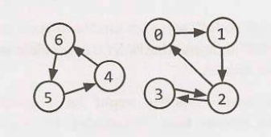
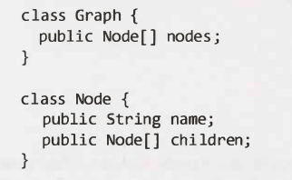

A tree is actually a type of graph, but not all graphs are trees. Simply put, a
tree is a connected graph without cycles. A graph is simply a collection of
nodes with edges between (some of) them.

- Graphs can be either directed (like the following graph) or undirected. While
  directed edges are like a one-way street, undirected edges are like a two-way
  street.
- The graph might consist of multiple isolated subgraphs. If there is a path
  between every pair of vertices, it is called a "connected graph:'
- The graph can also have cycles (or not). An "acyclic graph" is one without
  cycles.

Visually, you could draw a graph like this:

In terms of programming, there are two common ways to represent a graph.

**Adjacency List**

This is the most common way to represent a graph. Every vertex (or node) stores
a list of adjacent vertices. In an undirected graph, an edge like (a, b) would
be stored twice: once in a's adjacent vertices and once in b's adjacent
vertices.

A simple class definition for a graph node could look essentially the same as a
tree node.

The Graph class is used because, unlike in a tree, you can't necessarily reach
all the nodes from a single node.

You don't necessarily need any additional classes to represent a graph. An array
(or a hash table) of lists (arrays, arraylists, linked lists, etc.) can store
the adjacency list.

The graph above could be represented as:

<!-- prettier-ignore-start -->
0: 1
1: 2
2: 0, 3 3: 2
4: 6
5: 4
6: 5
<!-- prettier-ignore-end -->

This is a bit more compact, but it isn't quite as clean. We tend to use node
classes unless there's a compelling reason not to.

**Adjacency Matrices**

An adjacency matrix is an `NxN` boolean matrix (where `N` is the number of
nodes), where a true value at `matrix[i][j]` indicates an edge from node `i` to
node `j`. (You can also use an integer matrix with Os and 1s.)

In an undirected graph, an adjacency matrix will be symmetric.

In a directed graph, it will not (necessarily) be.

The same graph algorithms that are used on adjacency lists (breadth-first
search, etc.) can be performed with adjacency matrices, but they may be somewhat
less efficient. In the adjacency list representation, you can easily iterate
through the neighbors of a node. In the adjacency matrix representation, you
will need to iterate through all the nodes to identify a node's neighbors.
