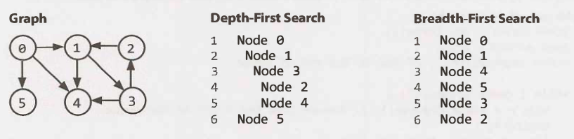

The two most common ways to search a graph are `depth-first` search and
`breadth-first` search.

In `depth-first` search (DFS), we start at the root (or another arbitrarily
selected node) and explore each branch completely before moving on to the next
branch. That is, we go deep first (hence the name depth­ first search) before we
go wide.

In `breadth-first` search (BFS), we start at the root (or another arbitrarily
selected node) and explore each neighbor before going on to any of their
children. That is, we go wide (hence `breadth-first` search) before we go deep.

See the below depiction of a graph and its `depth-first` and `breadth-first`
search (assuming neighbors are iterated in numerical order).

Breadth-first search and depth-first search tend to be used in different
scenarios. DFS is often preferred if we want to visit every node in the graph.
Both will work just fine, but depth-first search is a bit simpler.

However, if we want to find the shortest path (or just any path) between two
nodes, BFS is generally better. Consider representing all the friendships in the
entire world in a graph and trying to find a path of friend­ ships between Ash
and Vanessa.

In depth-first search, we could take a path like Ash -> Brian -> Carleton ->
Davis -> Eric -> Farah -> Gayle -> Harry -> Isabella -> John·-> Kari... and then
find ourselves very far away. We could go through most of the world without
realizing that, in fact , Vanessa is Ash's friend.

We will still eventually find the path, but it may take a long time. It also
won't find us the shortest path. In breadth-first search, we would stay close to
Ash for as long as possible. We might iterate through many of Ash's friends, but
we wouldn't go to his more distant connections until absolutely necessary.

lf Vanessa is Ash's friend, or his friend-of-a-friend, we'll find this out
relatively quickly.
