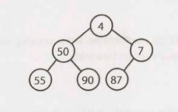
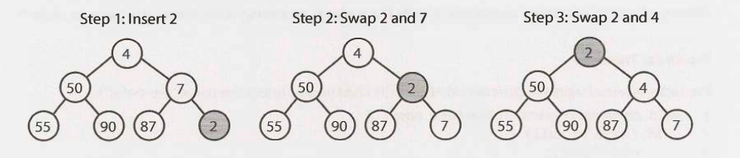
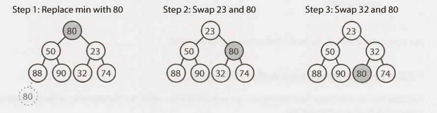

We'll just discuss min-heaps here. Max-heaps are essentially equivalent, but the
elements are in descending order rather than ascending order.

A min-heap is a complete binary tree (that is, totally filled other than the
rightmost elements on the last level) where each node is smaller than its
children. The root, therefore, is the minimum element in the tree.

We have two key operations on a min-heap: `insert` and `extract_min`.

**Insert**

When we insert into a min-heap, we always start by inserting the element at the
bottom. We insert at the rightmost spot so as to maintain the complete tree
property. Then, we "fix" the tree by swapping the new element with its parent,
until we find an appropriate spot for the element. We essentially bubble up the
minimum element.

**Extract Minimum Element**

Finding the minimum element of a min-heap is easy: it's always at the top.

The trickier part is how to remove it. (In fact, this isn't that tricky.) First,
we remove the minimum element and swap it with the last element in the heap (the
bottommost, rightmost element). Then, we bubble down this element, swapping it
with one of its children until the min­ heap property is restored.

Do we swap it with the left child or the right child? That depends on their
values. There's no inherent ordering between the left and right element, but
you'll need to take the smaller one in order to maintain the min-heap ordering.

This algorithm will also take `0(log n)` time.
