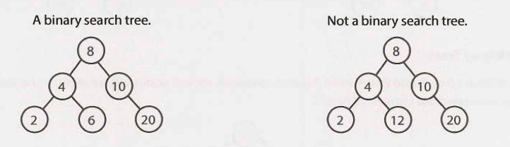

A binary search tree is a binary tree in which every node fits a specific
ordering property: `all left descendents <= n < all right descendents`. This
must be true for each node n.

> The definition of a binary search tree can vary slightly with respect to
> equality. Under some definitions, the tree cannot have duplicate values. In
> others, the duplicate values will be on the right or can be on either side.
> All are valid definitions, but you should clarify this with your interviewer.

Note that this inequality must be true for all of a node's descendents, not just
its immediate children. The following tree on the left below is a binary search
tree. The tree on the right is not, since 12 is to the left of 8.

When given a tree question, many candidates assume the interviewer means a
binary search tree. Be sure to ask. A binary search tree imposes the condition
that, for each node, its left descendents are less than or equal to the current
node, which is less than the right descendents.
