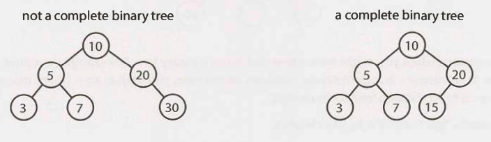

A complete binary tree is a binary tree in which every level of the tree is
fully filled, except for perhaps the last level. To the extent that the last
level is filled, it is filled left to right.

