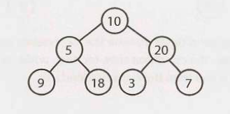

A perfect binary tree is one that is both full and complete. All leaf nodes will
be at the same level, and this level has the maximum number of nodes.

_Note that perfect trees are rare in interviews and in real life,as a perfect
tree must have exactly `2k - 1 nodes` (where k is the number of levels). In an
interview, do not assume a binary tree is perfect._
