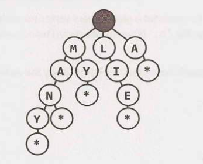

A trie (sometimes called a prefix tree) is a funny data structure. It comes up a
lot in interview questions, but algorithm textbooks don't spend much time on
this data structure.

A trie is a variant of an `n-ary` tree in which characters are stored at each
node. Each path down the tree may represent a word.

The \* nodes (sometimes called "null nodes") are often used to indicate complete
words. For example, the fact that there is a \* node under MANY indicates that
MANY is a complete word. The existence of the MA path indicates there are words
that start with MA.

The actual implementation of these \* nodes might be a special type of child
(such as a `TerminatingTrieNode`, which inherits from `TrieNode`). Or, we could
use just a boolean flag `terminates` within the "parent" node.

A node in a trie could have anywhere from 1 through `ALPHABET_SIZE + 1` children
(or, 0 through `ALPHABET_SIZE` if a boolean flag is used instead of a \* node).

Very commonly, a trie is used to store the entire (English) language for quick
prefix lookups. While a hash table can quickly look up whether a string is a
valid word, it cannot tell us if a string is a prefix of any valid words. A trie
can do this very quickly.

> How quickly? A trie can check if a string is a valid prefix in `0(K)` time,
> where `K` is the length of the string. This is actually the same runtime as a
> hash table will take. Although we often refer to hash table lookups as being
> `0(1)` time, this isn't entirely true. A hash table must read through all the
> characters in the input, which takes `O(K)` time in the case of a word lookup.

Many problems involving lists of valid words leverage a trie as an optimization.
In situations when we search through the tree on related prefixes repeatedly
(e.g., looking up M, then MA, then MAN, then MANY), we might pass around a
reference to the current node in the tree. This will allow us to just check if Y
is a child of MAN, rather than starting from the root each time.
