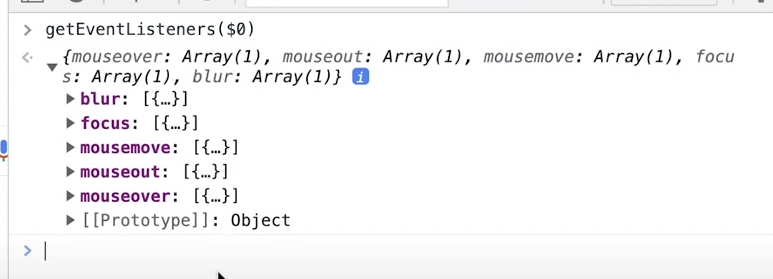

## Chrome Dev Tools Tips

- Type `$_` in the console to use the last value outputted by the console

- Use `$0` to `$4` to navigate between your last 5 inspected elements (`$0` is the most recent)

- the `$` selector is a shortcut for `querySelector` (like jQuery)

> note: use two dollars for `querySelectorAll`

- `console.table()` (or `table()`)

- use `keys()` to get only the keys of the object

- use `values()` to get only the values of the object

- use `copy()` to copy anything to the clipboard

- use `getEventListeners($0)` see all event listeners for an element

- use `monitorEvents(element, eventType)` to monitor all events on an element, for example we log all resizes
  on the window events by using `monitorEvents(window, 'resize')`

> note: use unmonitorEvents(element) to stop monitoring events

- use `monitor(functionReference)` to monitor all function calls of the referenced object

> note: use unmonitor(funtionReferece) to stop monitoring function calls

