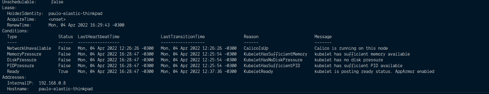

## Questions for this assignment

### How many nodes does your cluster have?

`kubectl get nodes` or to get the count: `kubectl get nodes --no-headers | wc -l`


### What kernel version and what container engine is each node running?

`kubectl get nodes -o wide`



### List only the pods in the kube-system namespace.

`kubectl get pods n kube-system`

```
NAME                                                        READY   STATUS    RESTARTS   AGE
event-exporter-gke-5479fd58c8-cq95l                         2/2     Running   0          8d
fluentbit-gke-79xv4                                         2/2     Running   0          8d
fluentbit-gke-pvj56                                         2/2     Running   0          8d
fluentbit-gke-qvvt4                                         2/2     Running   0          8d
gke-metrics-agent-7fvlp                                     1/1     Running   0          8d
gke-metrics-agent-9kb6g                                     1/1     Running   0          8d
```

### Explain the role of some of these pods.

On some clusters, we might see pods named etcd-XXX or kube-apiserver-XXX. these correspond to control plane
components.

It's also common to see kubedns-XXX or coredns-XXX. These implement the DNS service that lets us resolve
service names into their service IP's.

### If there are few or no pods in kube-system, why could that be?

On some clusters, the control plane is located outside the cluster itself, and not running as containers.

In that case, the control plane won't show up in kube-system, but you can find on host with ps aux | grep
kube.

### Create a deployment using kubectl create that runs the image bretfisher/clock and name it ticktock.

`kubectl create deployment ticktock --image=bretfisher/clock`

By default, it will have one replica, translating to one container.

### Increase the number of pods running in that deployment to three.

`kubectl scale deployment ticktock --replicas=3`

### Use a selector to output only the last line of logs of each container.

`kubectl logs -l app=ticktock --tail 1 -f`
