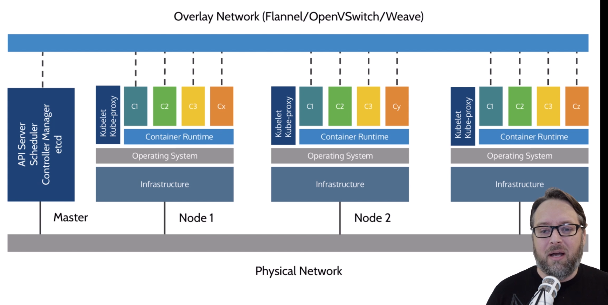
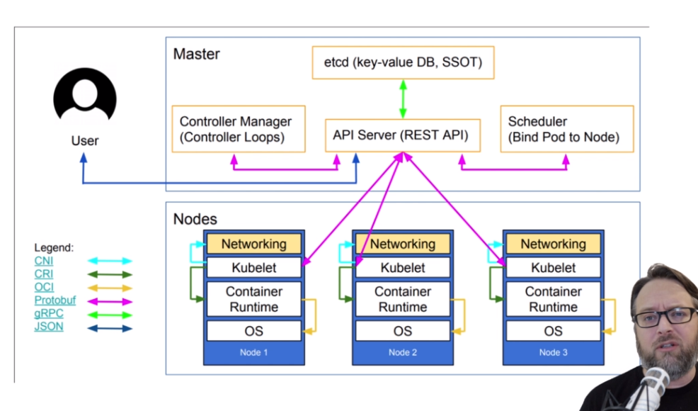
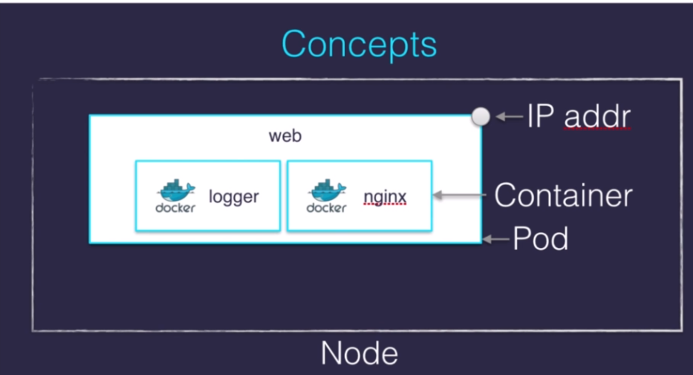
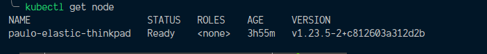
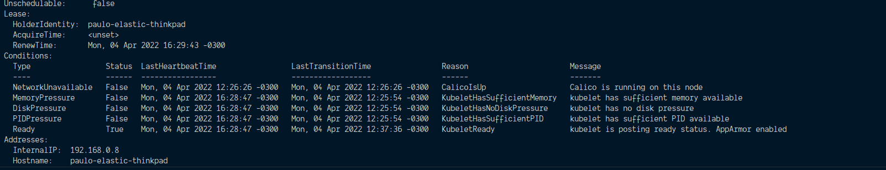
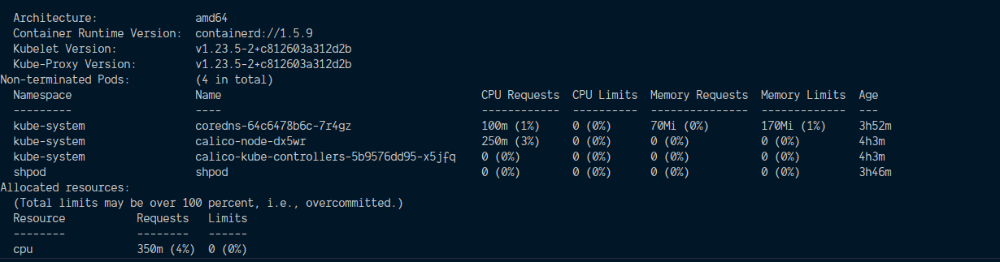
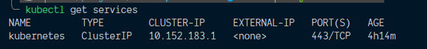
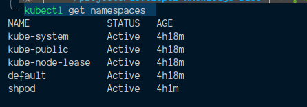

# Kubernetes

## Orchestration

### Why orchestration

- They make decisions about when and where to "do work"
- We need "many servers to act like one", and run many conainers

### Container orchestration

- Schedule running of containers on servers
- Dispatch them across many nodes
- Monitor and react to container and server health
- Provide storage, networking, proxy, security and logging features
- Doo all this in a declarative way, rather than imperative
- Provide API's to allow extensibility and management

### Major container orchestrators

- Kubernetes, aka K8s
- Docker Swarm (and Swarm classic)
- Apache Mesos/Marathon
- Cloud Foundry
- Amazon ECS (not OSS, AWS-only)
- HashiCorp Nomad

- Many of these tools run on top of Docker Engine
- Kubernetes is the one orchestrator with many distributions

## Kubernetes distributions

- Kubernetes "vanilla upstream" - the github repo that store all the pure kubernetes project source code
- Cloud-Managed distros: AKS, GKE, EKS, DOK, etc...
- Self-managed distros: RedHat OpenShift, Docker Enterprise, Rancher, Canonical Charmed, openSUSE Kubic,
  etc...
- Vanilla installers: kubeadm, kops, kubicorn, etc... (the hardest choice)
- Local dev/test: Docker Desktop, minikube, microK8s
- CI testing: kind
- Special builds: Rancher K3s
- And [many, many more](https://kubernetes.io/partners/#conformance)...

## Kubernetes concepts

- Kubernetes is a container management system
- It runs and manages containerized applications on a cluster (one or more servers)
- Often this is simply called "container orchestration"
- Sometimes shortned to Kube or K8s ("Kay-eights" or "Kates")

## Basic things we can ask Kubernetes to do

- Start 5 containers using image `atseashop/api:v1.3`
- Place an internal load balancer in front of these containers
- Start 10 containers using image `atseashop/webfront:v1.3`
- Place a public load balancer in front of these containers
- Grow our clusters and add containers for traffic spikes (i.e: Black Friday or Christmas)
- Replace containers with the new image `atseashop/webfront:v1.4` without taking the one down first

## Other things that kubernetes can do for us

- Basic autoscaling
- Blue/green deployment, canary deployment
- Long running services, but also batch (one-off) and CRON-like jobs
- Overcommit our cluster and evict low-priority jobs
- Run services with stateful data (databases etc)
- Fine-grained access control defining what can be done by whom on which resources, (also known as RBAC)
- Integrating third party services (service catalog)
- Automating complex tasks (operators)

## Kubernetes Architecture



In this diagram we see the following:

- 3 nodes: master (in control of the environment, also known as control plane), node 1, node 2
- - master: it has four parts:
  - API server (the heart and soul of Kubernetes where everything is talking through it, including agents on
    the nodes, like the kubelet agent from the diagram)
  - Scheduler
  - Controller manager
  - etcd (the database, a key value store) that contains all the information from configuring the environment
    and how apps are supposed to run

### The nodes

Nodes were formely called "minions", the nodes executing our containers run a collection of services:

- a container Engine (typically Docker), that's because kubernetes itself doesn't start your containers, it
  need that lower level component provided to it.
- kubelet (the "node agent")
- kube-proxy (a necessary but not sufficient network component)

### The control plane

The kubernetes logic (its "brains") is a collection of services:

- the API server (our point of entry to everything)
- core services like the scheduler and controller manager
- `etcd` (a highly available key/value store; the "database" of kubernetes)

Together, these services form the control plane of our cluster, the control plane is also called the "master"



On the diagram above, these colors will make a difference. But, just notice that we've got technically three
nodes at the bottom.

Each one of those has networking components like kube-proxy, possibly a different, additional feature
depending on how you set the networking. There's always going to be some sort of networking component there.
There's the kubelet agent, then there's your Docker or other container runtime, and then the OS, usually
Linux, maybe Windows.

Up at the top, the `etcd` database. That's a key value store. That will be on one or more nodes, depending on
whether you need high availability.

Then you have the controller manager which manages a bunch of controllers. You've probably heard of some of
them already, like deployments and ReplicaSets.

Then the API server, you can see how everything's talking through that API server in the middle. The scheduler
over there, on the side, on the right side, is making decisions about where things should go on which nodes.

### Running the control plane on special nodes

- it is common to reserve a dedicated node for the control plane (Except for single-node development clusters,
  like when using minikube)
- This node is then called "a master" (be aware of the ambiguous: is the master a node, or the whole control
  plane?)
- Normal applications are restricted from running on this node (by using a mechanism called "taints")
- When high availability is required, each service of the control place must be resilient
- The control plane is then replicated on multiple nodes (this is sometimes called a "multi-master" setup)

### Running the control plane outside containers (cloud distributions)

- the services of the control plane can run in or out of containers
- for instance: since `etcd` is a critica lservice, some people deploy it directly on a dedicated cluster
  (without containers)
- in some hosted kubernetes offerings (eg: AKS, GKE, EKS), the control plane is invisible (we only see a
  kubernetes API endpoint), that's because they are managing the control plane for us, and handling all the
  logic of how it works
- in that case, there is no "master node"

### Containers

By default, Kubernetes itself does not run containers, it uses the Docker Engine to run containers, but it can
be configured to use other containers, for example:

- `containerd`, that is maintained by Docker, IMB and community
- `CRI-O`: maintained by RED Hat, Suse, and community

### Interacting with Kubernetes

We interact through the Kubernetes API, which is a (mostly) RESTful API.

it allows us to create, read, update and delete resources, common resource types are:

- `node` (a machine - physical or virtual - in our cluster)
- `pod` (group of containers running together on a node)
- `service` (stable network endpoint to connect to one or multiple containers)



#### Pods

The idea of a pod is it's the lowest deployable unit in Kubernetes, we can never touch containers directly,
instead we deploy, update and delete pods. Most of the time, pos will have one container, but it can have
multiple.

- Pods are a abstraction
- it can have multiple containers working together (usually is only one container per pod)
- pod is our smallest deployable unit; kubernetes won't manage containers directly
- ip addresses are associated with pods, not with individual containers
- container in a pod share `localhost`, and can share volumes
- in reality, docker doesn't know a pod, only containers/namespaces/volumes

## Kubernetes Commands

[Official Documentation](https://kubernetes.io/docs/reference/#api-reference)

- Be aware that some distributions might expand the list of commands, so it's good to have a understand about
  how to list and interact with custom resources that won't be available in the official documentation.

### kubectl get node

list all machines in the cluster, can be abbreviated to `kubectl get no`



- it supports changing the output with the -o flag, i.e `kubectl get no -o yaml`, or `kubectl get no -o json`
- also show more information with the -o wide flag, i.e `kubectl get no -o wide`
- We can use `jq` to filter the output from the JSON format, i.e
  `kubectl get no -o json | jq ".items[] | {name:.metadata.name} + .status.capacity"`

### kubectl describe node <node-name>

Shows informations about the node itself, also it shows pods running





### kubectl api-resources

List all the resources available in the cluster

### kubectl explain <resource>

Show information about the resource, i.e `kubectl explain pods`

```bash
KIND:     Pod
VERSION:  v1

DESCRIPTION:
     Pod is a collection of containers that can run on a host. This resource is
     created by clients and scheduled onto hosts.

FIELDS:
   apiVersion   <string>
     APIVersion defines the versioned schema of this representation of an
     object. Servers should convert recognized schemas to the latest internal
     value, and may reject unrecognized values. More info:
     https://git.k8s.io/community/contributors/devel/sig-architecture/api-conventions.md#resources

   kind <string>
     Kind is a string value representing the REST resource this object
     represents. Servers may infer this from the endpoint the client submits
     requests to. Cannot be updated. In CamelCase. More info:
     https://git.k8s.io/community/contributors/devel/sig-architecture/api-conventions.md#types-kinds

   metadata     <Object>
     Standard object metadata. More info:
     https://git.k8s.io/community/contributors/devel/sig-architecture/api-conventions.md#metadata

   spec <Object>
     Specification of the desired behavior of the pod. More info:
     https://git.k8s.io/community/contributors/devel/sig-architecture/api-conventions.md#spec-and-status

   status       <Object>
     Most recently observed status of the pod. This data may not be up to date.
     Populated by the system. Read-only. More info:
     https://git.k8s.io/community/contributors/devel/sig-architecture/api-conventions.md#spec-and-status
```

- it also can show information about all the fields wr can interact with a resource with
  `kubectl explain node --recursive`

### kubectl get services

A service is a stable endpoint to connect to "something". (it can be used to access a set of pods)



### kubectl get namespaces

It shows the namespaces in the cluster. Namespaces allow us to segregate resources



[Reference](https://kubernetes.io/docs/concepts/overview/working-with-objects/namespaces/)

- `kube-public`: just used for installation, and then eventually to connect into something
- `kube-node-lease`: node leases are a way to implement heartbeat for nodes

### kubectl get pods

We can use `kubectl get pods --all-namespaces` or `kubectl get pods -A` to see all the pods in the cluster,
regardless of the namespace

- You can list all the pods in a namespace with `kubectl get pods --namespace <namespace>`, i.e
  `kubectl get pods --namespace=kube-system`

```bash
NAME                                       READY   STATUS    RESTARTS   AGE
coredns-64c6478b6c-7r4gz                   1/1     Running   0          4h17m
calico-node-dx5wr                          1/1     Running   0          4h28m
calico-kube-controllers-5b9576dd95-x5jfq   1/1     Running   0          4h28m
```

#### Usage:

- You can get namespaces using `kubectl get namespaces`

```
NAME              STATUS   AGE
kube-system       Active   22h
kube-public       Active   22h
kube-node-lease   Active   22h
default           Active   22h
shpod             Active   22h
```

- then you can get informations about the namespace

- `kubectl -n kube-public get pods`

```
No resources found in kube-public namespace.
```

- `kubectl -n kube-public get configmaps`

```
NAME                     DATA   AGE
local-registry-hosting   1      22h
kube-root-ca.crt         1      22h
```

- `kubectl -n kube-public get configmap local-registry-hosting -o yaml`

```yml
apiVersion: v1
data:
  localRegistryHosting.v1: |
    help: "https://microk8s.io/docs/registry-built-in"
kind: ConfigMap
metadata:
  annotations:
    kubectl.kubernetes.io/last-applied-configuration: |
      {"apiVersion":"v1","data":{"localRegistryHosting.v1":"help: \"https://microk8s.io/docs/registry-built-in\"\n"},"kind":"ConfigMap","metadata":{"annotations":{},"name":"local-registry-hosting","namespace":"kube-public"}}
  creationTimestamp: '2022-04-04T15:25:58Z'
  name: local-registry-hosting
  namespace: kube-public
  resourceVersion: '248'
  selfLink: /api/v1/namespaces/kube-public/configmaps/local-registry-hosting
  uid: 9ad6f99e-a48f-453e-8e94-2c9cbe65afa7
```
