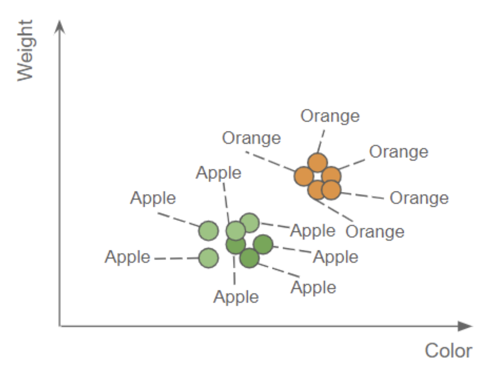
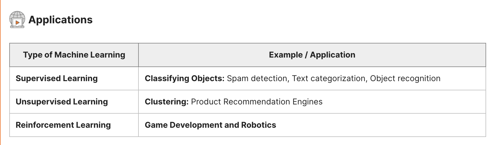
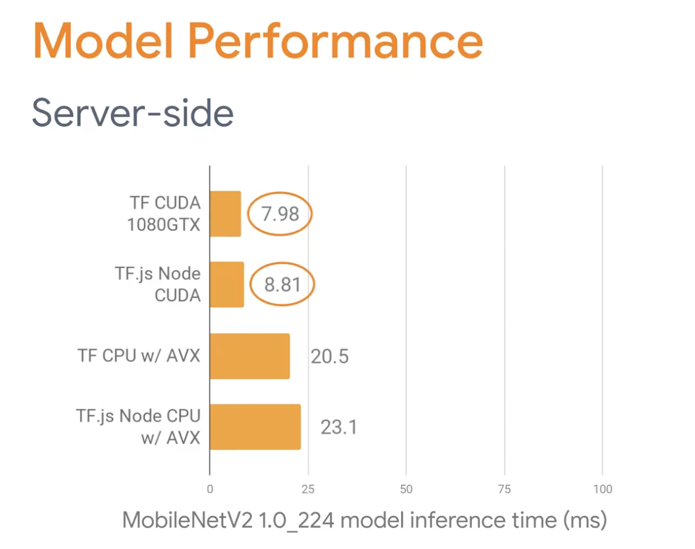
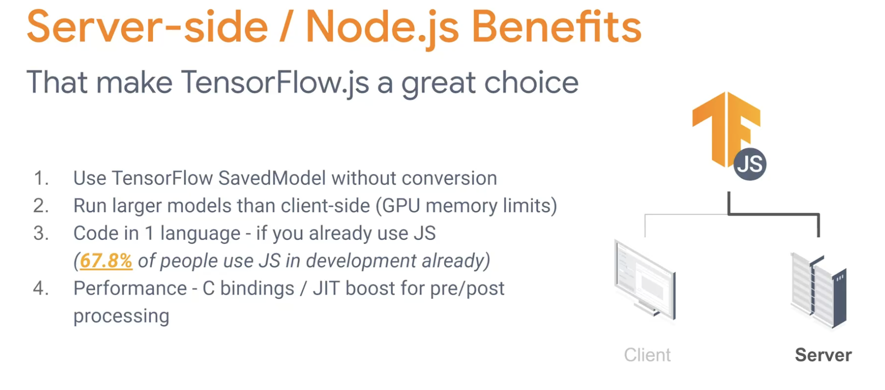
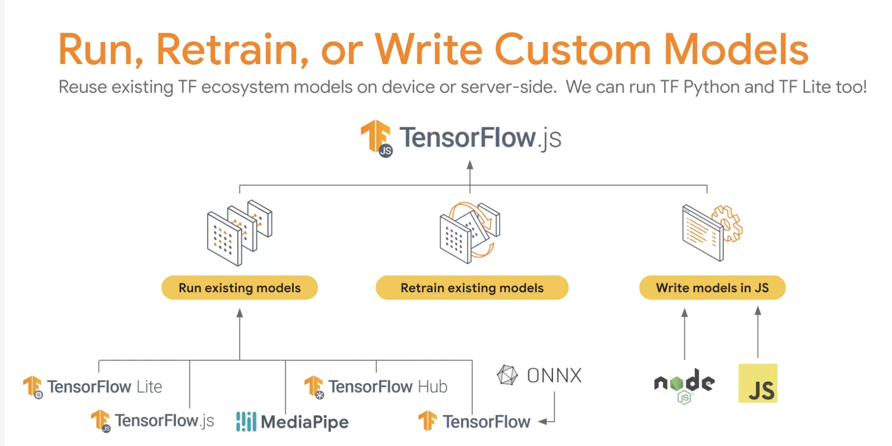
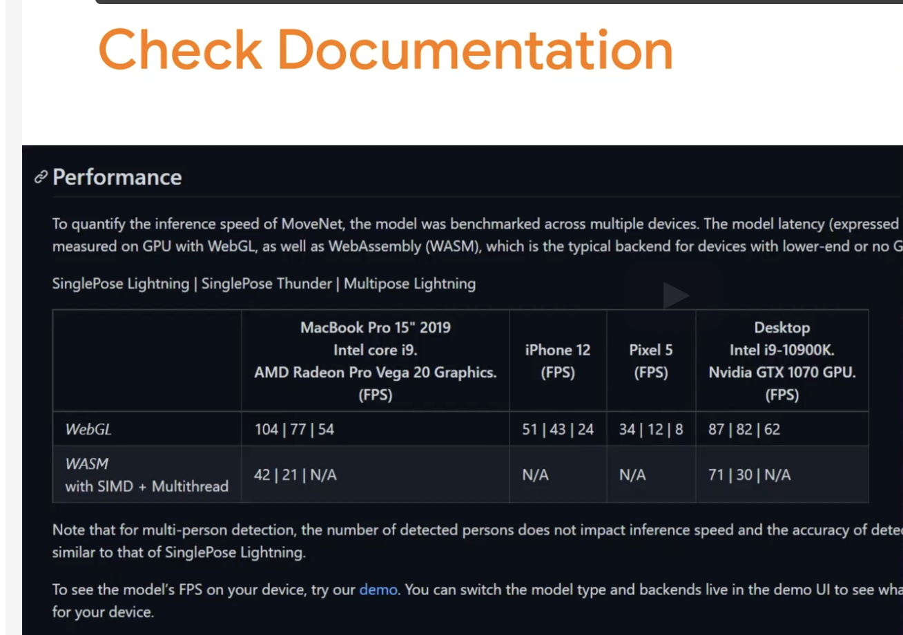
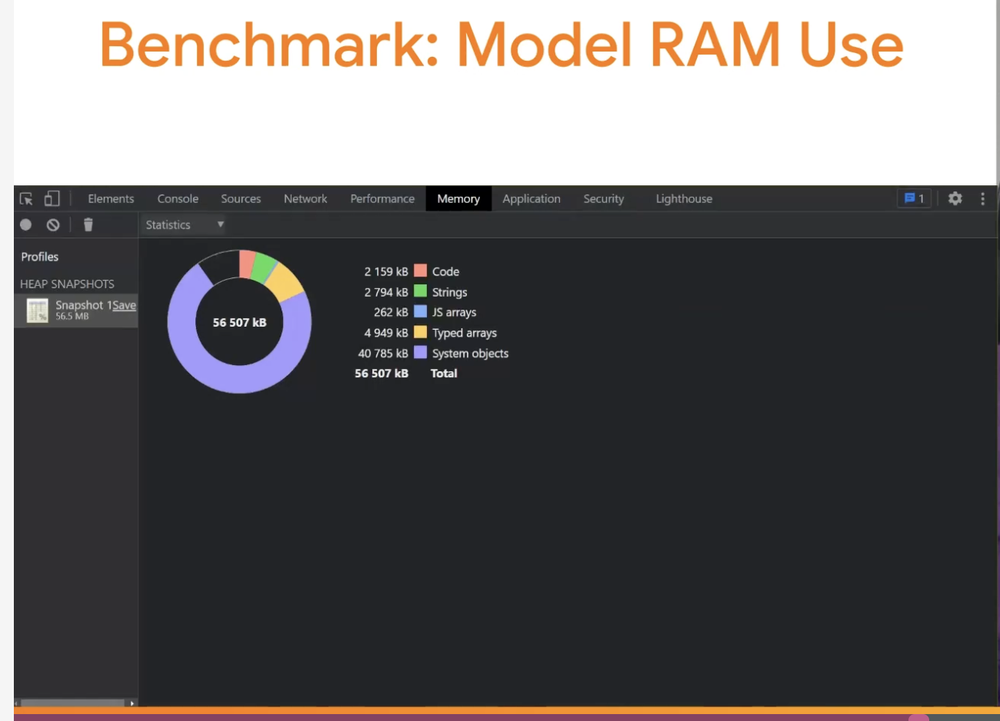
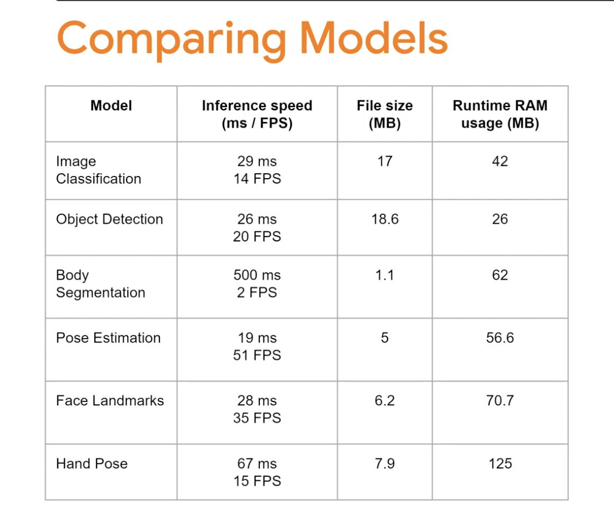
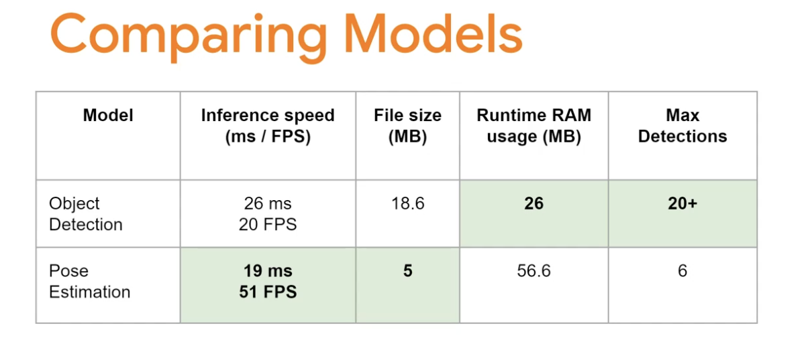

### Artificial Intelligence (AI)

A broad term that refers to human intelligence exhibited by machines. It is the science of making things
smart.

### Narrow AI

A type of artificial intelligence that can perform one (or a few) defined tasks as well or better than a human
expert. Common use cases could be classifying text in user contact forms and automatically routing those
messages to the respective sub-teams in a company, or accurately detecting tumors in medical images.

### Machine Learning (ML)

Machine learning is a subfield of artificial intelligence. It is the implementation of the actual program that
learns from prior experience to find patterns in a dataset. This paradigm contrasts traditional programming,
where you hand-code rules to process data and arrive at answers.

Consider the use case where you want to automate spam detection. A traditional programming approach would be
to formulate explicit rules for the program. In contrast, a machine learning program would learn by looking at
millions of comments that have already been labeled spam or not spam. The system would then attempt to
categorize new (and previously unseen) comments as spam or not spam based on what it has learned by finding
what words are statistically significant.

### Deep Learning

Deep Learning is a machine learning algorithm that involves Deep Neural Networks (DNN) code structures
arranged in layers that mimic how scientists believe the human brain works by learning patterns of patterns as
you go further down the layers.

#### ML Training

You need to consider that all machine learning models are initially untrained and there are several ways to
train them. Based on the training method, you can classify them into the following forms of machine learning:

- Supervised learning
- Unsupervised learning
- Reinforcement learning

#### Supervised Learning

Machine learning models are trained in supervised learning using labeled examples or data. The model is
provided with the ground truth for each example from which it will learn. In other words, each example
consists of the data and the label that tells the model what the correct output for the data is. Supervised
learning aims to learn from the examples and generalizes its learning to data it hasn’t seen before. A model
performs well only when you provide diverse and well-labeled data for training.



#### Unsupervised Learning

In unsupervised learning, the example data provided to the model is unlabeled. You may roughly know the number
of classes you expect to discover from the data. The model attempts to find related data and clusters them
together. Unsupervised learning is especially useful when dealing with datasets that are difficult to label.
An everyday use case for unsupervised learning is recommendation engines commonly found in retail websites,
where the system clusters people with similar shopping habits to recommend new products.

#### Reinforcement Learning

Reinforcement learning is a relatively new area of machine learning where the model takes actions to achieve a
goal while maximizing a reward that is defined. This system relies on trial and error with accurate “trials”
providing rewards. The system undergoes many iterations to find a combination of rules that achieves the best
results. The applications of reinforcement learning include gaming, robotics, and scientific research.



## TensorFlow

TensorFlow is an open-source library for numerical computation and large-scale machine learning. TensorFlow
bundles together a slew of machine learning and deep learning (aka neural networking) models and algorithms
and makes them useful by way of a common metaphor. It uses Python to provide a convenient front-end API for
building applications with the framework, while executing those applications in high-performance C++.

TensorFlow can train and run deep neural networks for handwritten digit classification, image recognition,
word embeddings, recurrent neural networks, sequence-to-sequence models for machine translation, natural
language processing, and PDE (partial differential equation) based simulations.

It has two APIs:

- High-level Layers API (like Keras)
- Low-level Ops API (mathematical)

hardware


performance



#### TensorFlow on server side with node.js



#### TensorFlow on client side


##### Models



- Pre made models


- Transfer learning (like teachable machine)


- Custom models

Writing your own models from a blank canvas

##### Pre Trained Models

##### Object Detection

Object detection involves detecting objects in images and identifying their locations and quantities. It is
different from image recognition, which only recognizes the presence of objects in an image without specific
localization.

The COCO-SSD model is trained on Microsoft's COCO dataset and uses the Single Shot MultiBox Detection (SSD)
architecture. It can recognize common objects like chairs, beds, cats, dogs, etc.

- [Object Detection (COCO-SSD) Model](link-to-model)
- [COCO-SSD Demo](link-to-demo)

---

##### Sound Detection

Sound detection models can recognize specific audio snippets and can be trained to recognize custom sounds or
commands.

The Speech Command Recognizer model is a JavaScript module used to recognize certain English words in
real-time or offline using recorded sounds.

- [Speech Command Recognizer Model](link-to-model)

---

##### Text Toxicity Detection

Text toxicity detection models can identify derogatory or toxic content in social media and online
communities. They help developers detect and address insulting, threatening, or toxic text before it is
consumed.

The Text Toxicity detection model is pre-trained on millions of comment examples and can identify toxic
content and categorize them as insults, obscenities, threats, etc.

- [Toxicity Classifier Model](link-to-model)
- [Toxicity Model Demo](link-to-demo)

---

##### Face Mesh

The Face Mesh model tracks 468 points on the human face in real-time. It is used in various applications, such
as detecting driver's loss of attention in vehicles or creating augmented reality (AR) makeup applications.

- [Face Landmarks Detection Models](link-to-models)
- [Face Mesh Demo](link-to-demo)

---

##### Pose Detection

The TensorFlow team has developed state-of-the-art pose detection models that can detect human poses in
real-time. The models include PoseNet, MoveNet, and BlazePose.

PoseNet tracks 17 keypoints on the human body, while MoveNet is optimized for diverse poses and actions,
running at high FPS. BlazePose tracks 33 key points and provides extra granularity, including hand tracking.

- [Pose Detection Models](link-to-models)
- [PoseNet Demo](link-to-demo)
- [MoveNet Demo](link-to-demo)
- [BlazePose Demo](link-to-demo)

---

##### Hand Pose Tracker

The Hand Pose Detection model can detect multiple hands in real-time by tracking 21 points on each hand. It
enables gesture recognition, sign language interpretation, or control of user interfaces.

- [Hand Pose Detection Model](link-to-model)
- [Hand Pose Detection Demo](link-to-demo)

---

##### Body Segmentation

Body segmentation models enable the segmentation of human bodies and, in some cases, pose estimation.

The BodyPix model can distinguish 24 different body parts and segment images into pixels belonging to various
human body parts. It is useful for applications involving multiple people in images or videos.

- [Body Pix Model](link-to-model)
- [Body Pix Demo](link-to-demo)

---

[Selfie Segmentation Demo (New! Faster and more accurate)](link-to-demo)

### Comparing models performance



benchmarking frames per second


Benchmarking Model Inference Speed

Use the following code snippet to calculate a model’s inference speed.

```js
async function calculateInferenceSpeed() {
  //  Record timestamp before model execution

  const timeStart = performance.now();

  // Execute model

  let results = await useSomeModel();

  // Record timestamp after model execution

  const timeEnd = performance.now();

  // Calculate time taken for model execution

  const timeTaken = timeEnd - timeStart;

  console.log(`Time taken ${timeTaken} ms.`);

  // Convert ms to FPS

  console.log(`Frames per sec: ${1000 / timeTaken}`);
}
```

Model’s inference speed: The time taken by a model, from receiving new data as inputs, to predicting an output
result.

model size


model ram usage



comparison



given a user wants a web app that looks into webcam stream and detect weather an invader is present or not,
object detection or pose estimation models seems to be the best options. Pose estimation is faster, however it
only detect up to 6 people, while object detection can detect up to 20 people.


